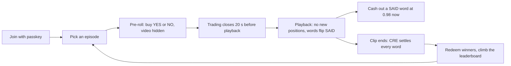

# SAYSO — Product Requirements

**Bet on the words before they're spoken.**
SAYSO turns a short video clip into a set of live word markets. Before playback, the board shows six words that might be said. Each word trades between 0 and 1 AUSD. When a word is spoken, its card flips to SAID within one Monad block; Chainlink CRE then checks two independent transcripts and settles it. Players join with a passkey: no wallet app, no seed phrase.

Testnet only. No real money moves through SAYSO.

Evidence labels: **[V]** verified with the linked source, **[I]** inference, **[U]** unverified, with the spike that settles it.

## 1. Problem

- Watching is passive. Opinion markets on culture are a judge-stated wish ("spectator capital and opinion markets", [Electric Capital 2026](https://data.electriccapital.com/posts/investing-in-user-owned-technology-26-opportunities-in-2026)) [V].
- Mention markets exist at centralized venues, settled by staff reading a transcript [I]. Onchain prediction markets settle in hours or days through dispute games [I].
- Nobody settles a spoken-word market inside the clip it is about, with the resolution evidence committed before anyone trades [I].

## 2. Product in one loop

## 3. Scope decisions

| # | Decision |
|---|---|
| P1 | **Replay Arena only.** Episodes play pre-recorded clips whose titles are hidden. No live streams in this release. |
| P2 | **SAID is instant, settlement is CRE.** The studio flags a spoken word onchain in about one block; only the CRE workflow finalizes YES or NO. |
| P3 | **Cash out now.** Playback allows no new positions; while a word is SAID but not yet final, a player can sell its YES into the house's 0.98 AUSD cash-out bid. |
| P4 | **Only YES trades on Kuru.** NO is a complete-set position: mint YES+NO for 1 AUSD and sell the YES in one transaction. |
| P5 | **Mobile-first PWA.** Installable web app, portrait. No app-store build. |
| P6 | **Free tooling first.** Offline transcription, public RPC, Envio HyperSync, CRE simulation until deploy access is granted. |
| P7 | **Testnet first.** Monad testnet 10143 for every contract, token and market. |

## 4. Users

- **Player** on a phone, crypto-curious, arrives from a shared link. Wants a round under five minutes and a clear win or loss.
- **Judge** testing between 14 and 27 Oct 2026 at any hour. Must be able to start an episode alone, clear storage mid-round, and recover the same account from the passkey.
- **Operator** (the team): curates clips and word lists, funds the house, watches studio health.

## 5. The episode

| Stage | Duration | What the player sees | What happens onchain |
|---|---|---|---|
| Scheduled | until start | Countdown, word board with opening prices | `EpisodeCreated`; one YES/NO pair and one Kuru YES/AUSD market per word |
| Pre-roll | 60 s | Players buy YES or NO for approximately the first 40 s; video hidden and blurred, "starts in 0:42"; trading closes 20 s before playback | House ladders rest on every book until trading closes, then all house quotes are pulled and confirmed before playback |
| Playback | clip length, 3 to 5 min | Video unblurs and plays; no new positions; a spoken word flips SAID with a haptic tick and can be cashed out at 0.98 AUSD (TESTNET) | `WordFlagged` within about one block of detection; house posts only the SAID word's 0.98 cash-out bid |
| Closed | until settlement | "Settling" on unflagged words; evidence links appear | `EpisodeClosed`; set minting stops |
| Settled | permanent | Green YES / grey NO per word, redeem button, CRE transaction link | `WordResolved` per word through the CRE receiver |

Rules:
- Six words per episode. Curators pick a mix of spoken words and decoys; the ratio is never shown per episode.
- Every episode commits two transcript Merkle roots before the first trade (section 7 of ARCHITECTURE). The words that will be said are fixed and provable before anyone trades.
- A judge can start an on-demand episode from the lobby when none is running. A scheduled episode also starts every hour so the leaderboard stays alive. The judging deployment runs on-demand episodes only to fit the testnet MON budget ([BLOCKERS B15](BLOCKERS.md)).
- Opening prices are 0.50 for every word. The house never quotes from transcript knowledge: it pulls every word's quotes before playback, spoken words and decoys alike, on the same uninformed schedule. Only the 0.98 cash-out bid at a SAID flag is informed.
- New positions open only during pre-roll. Trading closes 20 s before playback (`tradingClosesAtMs` in `packages/core`), leaving approximately 40 s of the 60 s pre-roll for buying; during playback the only trade is cashing out a SAID word at the house's 0.98 AUSD (TESTNET) bid. Settlement and redemption are unchanged.

### 5.1 What counts as "said"

A word counts when both transcription engines contain it within the same 1.5 s window after normalization: case-insensitive, punctuation stripped, plural `-s`/`-es` and possessive `'s` forms count, hyphenated compounds count when the word is a whole part. Homophones, partial words and words inside other words do not count. The full rule and test vectors live in `.claude/skills/word-matching/SKILL.md`; the CRE workflow and the studio import the same matcher from `packages/core`.

### 5.2 Prices and payouts

- YES and NO are ERC-20 tokens with 6 decimals. 1 YES + 1 NO always redeems for 1 AUSD before settlement.
- After settlement the winning side redeems for 1 AUSD and the losing side for 0.
- Prices display as cents ("62¢"); the tick is 1¢.
- Buying NO costs `1 − best YES bid`; the transaction refunds the YES sale proceeds.
- No fees on testnet.

## 6. Screens

Phone-first and fully responsive: every screen has a real phone layout (390 to 430 px) and a real desktop layout; no screen is a phone column floating on a desktop.

| # | Screen | Must show |
|---|---|---|
| S0 | Landing | What SAYSO is in one line, how a round plays, a tappable demo board, why outcomes are fair, Play CTA, TESTNET |
| S1 | Join | "Join with passkey" and "I already have one"; one sentence on what a passkey is; TESTNET label |
| S2 | Arena | Running or next episode with countdown, "Start an episode" when idle, last results, starter balance status |
| S3 | Episode | Video (16:9) above a 2×3 word board; each card shows word, price, state (open / SAID / YES / NO), own position |
| S4 | Ticket | Bottom sheet: YES/NO, amount, cost, payout if right, one confirm; cash-out button on SAID words |
| S5 | Results | Outcome per word, the transcript chunk that proves it, the CRE transaction, own profit or loss |
| S6 | Portfolio | Open positions, redeemable amount, "Redeem all" |
| S7 | Leaderboard | Episode and all-time profit in AUSD, trade count, rank change |
| S8 | Account | Address, deterministic nickname, balances, restore check, TESTNET |

## 7. Account and onboarding

- **Mera is the whole account layer.** The passkey PRF output derives the signing key; there is no seed phrase, extension or custody backend.
- **Stateless test.** Clearing storage or switching devices and signing in with the same passkey restores the same address, positions and nickname. The nickname is derived from the address, so no server profile exists.
- **Starter balance.** On first sign-in the studio drips testnet MON for gas and test AUSD for play, once per address, rate-limited.
- **One-time approval.** AUSD uses its ERC-2612 permit for complete sets; trades go through `SaysoMarkets`, so a player approves it for AUSD once during onboarding and never approves outcome tokens or Kuru books.
- Mera's PRF is unavailable in some desktop browser profiles; S1 detects this and points to a phone or a supported browser.

## 8. Design principles

No generic AI interface. The direction is a toy-box game show starring the SaySo mascot: warm paper, white sticker cards with ink outlines, big 3D voxel objects that react to the cursor, a sticker book of voxel illustrations, and one red that belongs to the mascot and to the SAID moment.

- Wow in the first second: the landing opens on a living 3D scene, not a template hero.
- In the game, the logo red means SAID or LIVE; one gain colour; losses stay neutral.
- Words and key numbers in Plus Jakarta Sans ExtraBold, prices in tabular figures.
- The signature moment is the card flip: a split-flap turn, reaction stickers, a sound and a haptic tick when a word is said.
- Motion explains the product or rewards an action; landing ambience pauses off-screen and respects reduced motion. No neon, dark-purple gradients or glassmorphism.
- Sound is short, bright and mutable; no music competes with the clip's speech.
- Every number on screen opens its source: book, transaction, transcript chunk.

Tokens, type, motion, 3D, assets and sound are specified in [DESIGN](DESIGN.md); the `emil-design-eng` skill governs craft.

## 9. Bounties and tracks

| Priority | Target | Load-bearing proof |
|---|---|---|
| P0 | Track 03 Social, Attention & Culture | "Markets on cultural outcomes" is an official example ([track brief](https://monad.xyz/developers/hackathons/metropolis)) [V] |
| Eligibility pending | Kuru: Bring New Assets & Markets | Spoken-word YES/AUSD books fit the asset-class examples, but the bounty is Track 01; Track 03 entry needs written organizer confirmation ([SUBMISSIONS](SUBMISSIONS.md)) |
| P0 | Chainlink CRE | Only the CRE forwarder can finalize a word; remove CRE and nothing settles |
| P0 | Mera-powered UX | Passkey-only accounts and the stateless restore |
| P1 | Envio | Trade feed, positions and leaderboard come from HyperIndex |
| Out | Agora mobile trading | Verified requirement is Mera + AUSD + Perpl trades; current Kuru-only Replay Arena does not qualify ([SUBMISSIONS](SUBMISSIONS.md)) |

## 10. Success criteria

The demo never cuts this path: a word is said in the clip → its card flips SAID → a player cashes out or holds → CRE settles → the player redeems AUSD, all on camera, with every transaction on the testnet explorer.

- A fresh phone completes S1 to a first trade in under 90 seconds.
- Flag latency (spoken timestamp to `WordFlagged` receipt) under 1 second.
- Settlement latency (clip end to the last `WordResolved`) measured and reported in the README.
- A judge can start an episode with nobody from the team online.

## 11. Non-goals

Live streams, mainnet deployment, real money, app-store builds, user-created episodes, fees, and any market not tied to a committed transcript.

## 12. Risks

| Risk | Response |
|---|---|
| Gambling law (Indonesia prohibits gambling) | Testnet tokens only, no fiat path, stated in the README and video |
| Thin books | House flip-order ladders on every word; players only send immediate-or-cancel orders, so no player order rests on a book |
| A clip is recognisable | Titles hidden, team-recorded and public-domain sources, testnet stakes |
| CRE deploy access not granted in time | The studio runs the same workflow through `cre workflow simulate --broadcast`; README states which mode produced each settlement |
| Test AUSD supply | Faucet cadence spike S1; fallback quote token listed in INTEGRATIONS |
