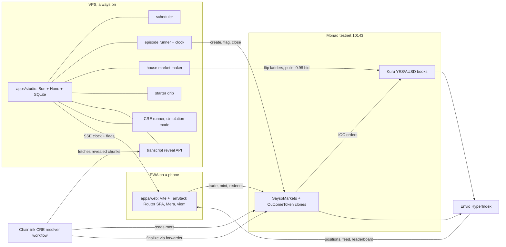
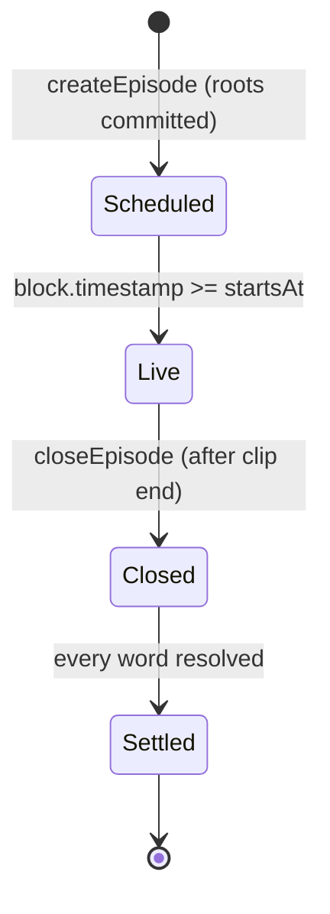
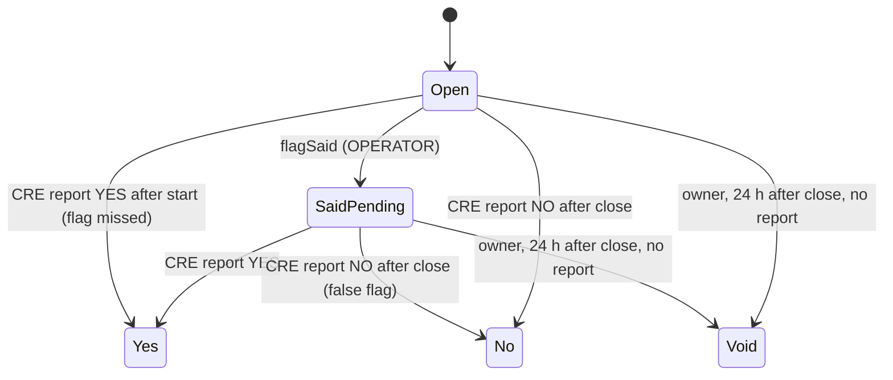
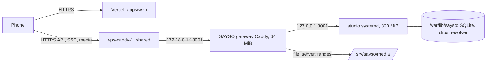

# Architecture

How SAYSO is built: components, boundaries, flows, the transcript commitment, the trust model, the pinned stack and how it runs. Product rules live in `docs/PRD.md`; external interfaces in `INTEGRATIONS.md`; contract surface in `SMART-CONTRACTS.md`; schemas in `ERD.md`.

Labels: **[V]** verified with source, **[I]** inference, **[U]** unverified with the settling spike.

## 1. Shape



Chain is truth. Envio and SQLite are read models; nothing a player owns lives only off chain.

## 2. Repo layout

Status column: **built** means tracked code exists today; a phase number means the folder arrives in that BUILD-PLAN phase.

```
packages/core/       built     Pure TypeScript shared by web, studio and CRE. No I/O, no React.
  src/               built       match, transcript, merkle, units, nickname, addresses, explorer;
                                 one *.test.ts beside each module; index.ts is the only entry
  abi/               built       vendored Kuru ABIs (kuru.ts) + SOURCE.md; sayso.ts generated from forge artifacts
  scripts/           built       vendor-kuru-abi, export-merkle-vectors, check-addresses
contracts/           built     Foundry (Soldeer deps): unit, fork (MONAD_FORK=1) and Merkle vector tests;
                               src/ SaysoMarkets, OutcomeToken, KuruTrade, vendor/chainlink; script/Deploy.s.sol
tools/transcribe/    built     Offline pipeline: two engines -> chunks -> roots -> flag plan (Bun CLI + vosk/ uv project)
clips/fixtures/      built     One tracked fixture clip (manifest + chunks, no media) for tests;
                               real clips, manifests and transcripts stay untracked studio data
cre/resolver/        built     CRE TypeScript workflow: log triggers, HTTP fetch, proof checks, report
apps/studio/         built     Bun + Hono: SQLite, reveal, scheduler/flags/SSE, permanent house maker, starter drip and receipt-backed CRE runner; funded live acceptance pending
indexer/             built     Envio config, schema and cashflow/position handlers; live sync and hosting gated by deploy
apps/web/            built     Vite + TanStack Router PWA with DESIGN tokens; S0 landing, screens S1–S8 (phase 7), Mera, signing;
                               assets-src/ voxel and logo sources, public/sfx/ mastered sound effects
tools/sfx/           built     Offline ElevenLabs sound-effect generation + ffmpeg mastering and measurement (DESIGN section 10)
deploy/              phase 5   systemd unit and Caddy config
docs/                built     PRD, DESIGN, BLOCKERS, LESSONS; technical/ ARCHITECTURE, BUILD-PLAN,
                               SMART-CONTRACTS, ERD, INTEGRATIONS
.claude/skills/      built     Vendored + project skills (skills-lock.json pins sources)
.omp/agents/         built     Persona subagents: visual-designer, sound-engineer
```

Bun workspaces: `apps/*`, `packages/*`, `cre/*`, `tools/*`, `indexer`. Envio 3.12.1's CLI native addon requires Linux or macOS; Windows development runs indexer codegen and full `bun run verify` under WSL, not a skipped indexer script.

## 3. Components and boundaries

| Component | Owns | Never does |
|---|---|---|
| `apps/web` | Screens, Mera passkey session, signing, transaction sequencing by block, SSE subscription | Hold a key outside the Mera session; compute settlement |
| `apps/studio` | Episode schedule, playback clock, flags, house quotes, starter drip, chunk reveal, simulation-mode CRE runs, health | Sign for a player; finalize a word; reveal a chunk before its reveal time (section 6) |
| `packages/core` | `normalizeToken`, `matchesTarget`, `agreedSpokenTime`, `chunkTranscript`, `leafHash`, `merkleRoot`, `merkleProof`, `nicknameOf`, price/size conversions, gas table, ABIs | Network, clocks, randomness |
| `contracts` | Collateral, outcome tokens, episode and word state, trade entry points, CRE receiver | Store transcripts; trust the studio for outcomes |
| `cre/resolver` | Proof verification, matcher run, outcome report | Hold player funds; read anything but the roots and revealed chunks |
| `indexer` | Episodes, words, trades, positions, profit, leaderboard | Feed back into settlement |
| `tools/transcribe` | Two independent transcripts per clip, chunk files, roots | Run in production request paths |

Four distinct studio senders, each its own nonce stream: **OPERATOR** (create, flag, close), **BOT** (Kuru quotes), **DRIP** (starter balances), **REPORTER** (simulation forwarder writes). Config rejects duplicate role addresses. Transactions persist signed bytes/hash before broadcast and wait for a strictly later block after the prior receipt; unknown outcomes recover the identical bytes, never release the sender by elapsed time. Separate senders isolate Monad reserve-balance constraints [V: [reserve balance](https://docs.monad.xyz/developer-essentials/reserve-balance)].

## 4. State machines





A listed word trades while it is Open or SaidPending, including after episode close: YES buys/sells and NO sells remain allowed until finalization. Closing stops new complete sets (`mintSet`, permit mint and `buyNo`), not transfers or `burnSet`. Void redeems each side at `floor(amount / 2)` base units per call.

## 5. Flows

### 5.1 Create an episode

1. Studio picks the next clip (on-demand request or the hourly slot), loads its two chunk sets and roots from SQLite.
2. OPERATOR calls `createEpisode(clipId, rootA, rootB, startsAt, endsAt, words)`, which clones YES and NO tokens per word, then `listEpisode(episodeId)`, which deploys one Kuru YES/AUSD market per word through `Router.deployProxy` type 0.
3. BOT mints complete sets and provisions the same flip ladder around 0.50 on every book. A six-word seed uses 27 transactions, or 25 when shared AUSD allowances suffice: bounded AUSD approvals are checked once alongside the seed's clock/word reads, quote goes in one margin deposit, and each newly deployed YES token gets mint, journal-idempotent bounded approval, deposit and ladder. Each receipt-gated step performs one parallel pre-sign round, signs after its clip/state and successor-block guards, re-checks chain ID at broadcast, then polls the receipt. Bytecode/dependency identity cache only after matching chain verification. Books are recorded after the ladders; journal recovery, not a speculative fresh-token allowance read, skips completed approval steps. The 60 s pre-roll is unchanged: episode 7's 27-step public-RPC seed took 27 s; episode 12's seed completed about 30 s after admission.
4. Studio pushes the schedule over SSE; web shows the countdown.

### 5.2 Trade

All player trades go through `SaysoMarkets`, so one AUSD approval (or ERC-2612 permit) covers every word, and the contract emits one `Traded` event per fill for exact profit accounting.

- **Buy YES:** pull AUSD, `placeAndExecuteMarketBuy` on the word's book (IOC), send YES to the player.
- **Sell YES / cash out:** pull YES (the contract is the token's trusted spender), `placeAndExecuteMarketSell`, send AUSD.
- **Buy NO:** mint `n` sets against pooled collateral, sell all `n` YES (a partial fill reverts), send `n` NO, then pull only `n − proceeds` AUSD from the player.
- **Sell NO:** buy at least `n` YES with pooled collateral, sized by walking the book's asks, burn `n` sets, pay `n − cost`, return rounding dust YES; the collateral invariant (`AUSD balance >= totalSets`) is checked at the end of the call.

Kuru's non-margin contract-caller path is now live-proved: episode 11 bought YES and sold it at the 0.98 house bid, with exact wallet debits/credits and Kuru `Trade` logs recorded in [INTEGRATIONS section 2](INTEGRATIONS.md#2-kuru-order-books). Authenticated CRE settlement is a separate open gate. Exact contract rules remain SMART-CONTRACTS sections 3 and 6.

### 5.3 SAID flag (instant)

1. The studio knows every agreed spoken timestamp `t` in advance (replay clips, section 6).
2. At `t − 400 ms`, BOT pulls actual active flip orders, including replacement IDs. Its independent clock starts gating/book reads 1,500 ms before that scheduled send; the adapter's parallel pre-sign round starts 400 ms before it and never signs early. After cancellation confirmation and chain SAID, it posts a 0.98 bid sized from one block-pinned chain snapshot at or after the pull receipt: `YES.totalSupply − house wallet YES − house margin YES − markets custody YES − book custody YES`. A negative result is refused, and size is capped by house spendable AUSD and Kuru bounds. Envio is not a cash-out timing dependency.
3. OPERATOR's separate clock prepares a flag up to 1,000 ms early, starts its pre-sign reads 400 ms before `t`, then signs/sends no earlier than `t`. Chain ID is re-read before signing and broadcasting; a flag whose clip window elapsed during preparation is refused. BOT/CRE work cannot hold the OPERATOR nonce stream.
   `flagSaid` and the house's `batchCancelOrders`/`batchCancelFlipOrders` go through `eth_sendRawTransactionSync(raw, 1000)` with a 1,500 ms HTTP deadline, so the receipt arrives with the send. Only method-not-found/unsupported (`-32601`/`-32004`) switches that endpoint to `eth_sendRawTransaction` plus receipt polling for the process. Any other error, timeout or malformed receipt fails closed without resending; the signed journal recovers it as before. Each flag logs `"event":"flag_latency"` with spoken time, signing, RPC send/ack and receipt phases.
4. Phones receive the `WordFlagged` log or the SSE echo, whichever lands first, and flip the card at the player's presentation time `t + 1.5 s`, so the flip lands on the spoken word.

Players watch with a fixed 1.5 s presentation delay behind the studio clock. The planned pull is one block before the flag; actual inclusion and cash-out readiness require runtime measurement, not a timing guarantee. One-block inclusion is about 300 ms [V: [current facts](https://docs.monad.xyz/ai/current-facts.md)]. OPERATOR flags do not await BOT or CRE background work. Players only send immediate-or-cancel orders, so after a confirmed pull no house ask remains for an early chain-watcher to lift.

### 5.4 Settlement (CRE)

- **YES path.** At each chunk boundary, OPERATOR batches `markEvidence(episodeId, wordIds)` for flagged words whose chunks are now revealed. The `EvidenceReady` log triggers the workflow: it reads both roots from the contract, fetches the revealed chunks for each engine, verifies every proof, runs `agreedSpokenTime` on the verified tokens, and reports `(episodeId, wordIds, outcomes, evidenceHash)`. YES finality is therefore at most one chunk (10 s) plus the reveal margin plus CRE latency after the word.
- **NO path.** `EpisodeClosed` triggers the workflow. With every chunk revealed, it verifies both complete chunk sets against the roots, runs the matcher over the full transcript for each unresolved word, and reports all outcomes in one report.
- The report reaches `SaysoMarkets.onReport` only through the configured forwarder; the contract also checks the expected workflow ID.

Until deploy access is granted, the studio CRE runner invokes `cre workflow simulate --broadcast` for each trigger; reports then arrive through the simulation forwarder. Each settlement records its mode (`don` or `simulation`) and the README reports which mode produced it.

Simulation trigger discovery recovers confirmed action receipts and catches up canonical logs from `SAYSO_START_BLOCK`. Receipt-array log index selects the exact trigger. Success is corroborated from actual forwarder/receiver receipts and the durable REPORTER nonce, never stdout hashes. The resolver emits a bounded structured pre-write no-report marker only before report submission: a legitimate false flag releases the queue for close; a pre-write capability failure backs off safely. Interrupted/failed write execution without proof remains ambiguous and gates REPORTER until onchain reconciliation.

### 5.5 Redeem

After a word settles, the winning token redeems 1 AUSD per unit; the losing token redeems nothing; Void pays 0.5 per unit on both sides. BOT redeems house inventory after every episode to recycle AUSD.

## 6. Transcript commitment

The outcome of every word is fixed before the first trade and provable afterwards.

1. `tools/transcribe` runs two independent engines on the clip: whisper.cpp (engine A) and Vosk (engine B). Both emit word-level timestamps.
2. Tokens are normalized by `packages/core` (`normalizeToken`) into `[word, startMs, endMs]`, where both times are non-negative safe integers with `startMs <= endMs`; anything else is refused before hashing, because JSON would turn `NaN` or `Infinity` into `null`.
3. Tokens are grouped into 10,000 ms chunks by start time. Chunk `i` covers `[10000·i, 10000·(i+1))`. Every index from 0 to `ceil(duration / 10,000) − 1` exists, empty chunks included, so the NO path can prove a complete set.
4. `leaf = keccak256(abi.encode(clipId, engine, index, startMs, endMs, tokensHash))`; ABI types are `(bytes32 clipId, uint8 engine (A = 0, B = 1), uint32 index, uint64 startMs, uint64 endMs, bytes32 tokensHash)`. `tokensHash` is keccak256 of UTF-8 canonical JSON `[["word",start,end],...]` with no whitespace.
5. Each engine's leaves stay in chunk order and form a Merkle tree with commutative keccak pair hashing, the same scheme as OpenZeppelin `MerkleProof`; an odd node is promoted unchanged. `rootA` and `rootB` go onchain in `createEpisode`.
6. `clipId = keccak256(sha256(media file) ‖ manifestId)`: the raw 32-byte digest followed by the UTF-8 manifest id (`encodePacked(bytes32, string)`), not the digest's hex text. Anyone holding the media can rerun the pinned engines and audit both transcripts.
7. **Reveal schedule.** The reveal API serves chunk `i` with its proof only after studio time passes `startsAt + chunkEnd + 2,000 ms` (presentation delay plus margin). After `closeEpisode`, every chunk is public.

**Clock boundaries:** onchain `endsAt − startsAt = ceil(mediaDurationMs / 1000)` seconds, preserving the committed chunk count the CRE resolver derives. The studio closes at `endsAt + 2,000 ms`, not before the delayed player hears the final word. After a late restart, an Open word whose flag window elapsed stays Open for CRE's full-transcript close decision; the studio records the missed action instead of submitting an impossible flag.

Agreement rule: a word is said when both engines contain a matching token whose start times differ by at most 1,500 ms. The agreed spoken timestamp `t` is the earlier start. The flag schedule is computed offline from this rule.

## 7. Clock and playback

- Studio time is authoritative. `GET /v1/time` returns server milliseconds; the web estimates its offset from five pings and keeps the lowest round trip.
- The player computes `position = now + offset − startsAt − 1,500 ms` and seeks there. Drift above 250 ms is corrected with small `playbackRate` changes; scrubbing is disabled.
- Media is a progressive MP4 served with range requests from the VPS.

## 8. Trust model

| Actor | Can | Cannot |
|---|---|---|
| OPERATOR | Choose clip and words (committed before trading), flag, mark evidence, close, stop quoting | Change a transcript after commit, finalize a word, touch collateral |
| Owner | Set forwarder, expected workflow ID and report origin (simulation to production), void a word 24 h after close with no report, pause new episodes | Withdraw collateral, finalize a word |
| CRE | Report outcomes through the forwarder | Report for a different workflow ID |
| REPORTER key | In simulation mode, send the simulator's report transaction; `SaysoMarkets` accepts simulation-forwarder reports only when `tx.origin` is this key | Settle anything in DON mode (`reportOrigin` is zero) |
| Studio service | Reveal chunks on schedule, drip starter balances | Sign for a player |

In simulation mode, CRE runs on a single local node and the HTTP fetch is single-node consensus [V: [HTTP capability](https://docs.chain.link/cre/capabilities/http)]. The simulation forwarder verifies no signatures, so the REPORTER gate is the only thing stopping a forged report; trust in that mode rests on the studio host that holds REPORTER (SMART-CONTRACTS section 7). Deployed workflows run BFT consensus across a DON. The README states the mode of each settlement.

## 9. Tech stack

Versions are the latest stable releases checked on 2026-10-05 (`npm view`, GitHub releases). Pin exact versions in `package.json` and `foundry.toml`; upgrade deliberately.

| Layer | Choice | Version |
|---|---|---|
| Runtime, installs | Bun | 1.3.14 |
| Vite and Vitest runtime | Node (the studio's Vitest runs inside Bun for `bun:sqlite`) | 24.21.0 |
| Language | TypeScript | 7.0.2 |
| UI | React | 19.3.0 |
| Build | Vite, `@vitejs/plugin-react` | 8.3.3, 6.1.2 |
| Routing | `@tanstack/react-router`, `@tanstack/router-plugin` | 1.170.41, 1.168.42 |
| Server state | `@tanstack/react-query` | 5.104.1 |
| Client state | zustand | 5.0.15 |
| Styling | Tailwind CSS | 4.3.3 |
| Motion | motion | 14.0.0 |
| 3D (S0 landing, S5 win only) | three, `@react-three/fiber`, `@react-three/drei`, three-stdlib | 0.186.1, 9.8.1, 10.7.9, 2.36.1 |
| Fonts | `@fontsource-variable/plus-jakarta-sans`, `@fontsource-variable/inter` | 5.3.0, 5.3.0 |
| UI icons | lucide-react | 1.52.0 |
| Image build | sharp (voxel WebP) | 0.35.5 |
| Sound build | ElevenLabs `POST /v1/sound-generation` (`eleven_text_to_sound_v2`), ffmpeg | API, 8.1.2 |
| PWA | vite-plugin-pwa | 2.0.0 |
| Validation | zod | 4.6.5 |
| Chain I/O | viem | 2.57.2 |
| Accounts | `@category-labs/mera`, `@scure/bip32`, `@scure/bip39` | 0.2.0, 2.4.0, 2.4.0 |
| Studio API | Hono on Bun, `bun:sqlite` | 4.13.13 |
| Contracts | Foundry, Solidity, OpenZeppelin Contracts | 1.8.4, 0.8.37, 5.7.0 |
| Settlement | CRE CLI, `@chainlink/cre-sdk` | 1.36.0, 1.23.0 |
| Indexer | Envio HyperIndex | 3.12.1 |
| Transcription | whisper.cpp (`ggml-base.en`), Vosk (`vosk-model-en-us-0.22`) | 1.9.4, 0.3.45 (latest published wheel; 0.3.50 is a source-only tag, S7) |
| Lint and format | Biome | 2.5.15 |
| Tests | Vitest, Playwright | 5.0.3, 1.63.0 |

**Why a router-only SPA.** The web app is static files: TanStack Router gives type-safe routes and loaders in the browser, and everything dynamic comes from the chain, Envio and the studio. TanStack Start adds server rendering and server functions, which need a request-scoped server; SAYSO's server work is long-running (clocks, quotes, reveals), so it lives in the studio. The SPA ships from any static host.

No ethers: Kuru's published SDK depends on ethers v5, so only its ABIs are vendored into `packages/core`.

## 10. Runtime and hosting

| Piece | Where | Notes |
|---|---|---|
| `apps/web` | Vercel Hobby static build at a permanent `<project>.vercel.app` host (`apps/web/vercel.json`) | That host is the passkey relying-party ID and must never change after the first real passkey |
| `apps/studio` | Bun under systemd on the shared VPS, `127.0.0.1:3001`, behind a SAYSO-only Caddy gateway and the VPS's existing HTTPS Caddy | Must run 24/7 through judging (14 to 27 Oct 2026); `MemoryMax=320M` including CRE children (measured peak 272 MiB) |
| Clip media, manifests, transcripts | Private studio data in `/var/lib/sayso`; explicitly published MP4s in `/srv/sayso/media` | The gateway never mounts the studio tree; chunks public only through the reveal API |
| Indexer | Envio Cloud Development from `indexer/`, release branch `envio`; VPS compose fallback `deploy/indexer.compose.yaml` | Deployed 2026-10-09 (BUILD-PLAN 6.3); the 30-day life covers judging; each deployment has its own GraphQL URL |
| CRE | Deployed DON workflow, else studio-run simulation | Deploy access requested with `cre account access` |
| RPC | Studio: private QuickNode Monad testnet endpoint (Metropolis perk) in `RPC_URL`; browser and CRE: `https://testnet-rpc.monad.xyz` | Provider keys never reach the browser bundle or git; the studio still verifies chain 10143 before every sign |

Environment (`.env.example` lists every key): `RPC_URL`, `CHAIN_ID=10143`, `DEPLOYER_PK` (contract deploys only), `OPERATOR_PK`, `BOT_PK`, `DRIP_PK`, `REPORTER_PK` (signs simulated CRE reports; the only key `reportOrigin` accepts), `OPERATOR_ADDRESS` and `REPORTER_ADDRESS` (public addresses `Deploy.s.sol` wires), `SAYSO_MARKETS`, `AUSD`, `KURU_ROUTER`, `CRE_MODE=simulation|don`, `STUDIO_DATA_DIR` (outside the repo: `studio.sqlite` plus `clips/<id>/` transcribe output, ingested at start), `PORT=3001`, `VITE_RP_ID`, `VITE_STUDIO_URL`, `VITE_INDEXER_URL`, and the offline transcription paths `WHISPER_CLI`, `WHISPER_MODEL`, `VOSK_MODEL`, optional `VOSK_PYTHON_PROJECT`. Studio role keys and `SAYSO_MARKETS` may be absent while only the read API runs; loaded keys live in private fields and never appear in logs, JSON or `/v1/health`.

Studio execution additionally uses `STUDIO_REVEAL_URL`, `SAYSO_START_BLOCK`, `STUDIO_HOURLY_EPISODES` (`true` by default; `false` disables automatic hourly episodes without affecting on-demand requests; judging deployment uses `false` per BLOCKERS B15), `STUDIO_WEB_ORIGINS` (exact CORS origins; unset allows only local dev origins), optional `CRE_RESOLVER_DIR`, `CRE_CLI_PATH`, `CRE_RESOLVER_WASM` (release-built resolver WASM passed to `simulate --wasm`; the VPS needs it because compiling inside a run overran the 120 s CRE timeout), a private stable `DRIP_IP_SALT` (at least 32 characters, hidden from inspection) and `DRIP_MAX_PER_IP_HOUR` (positive integer, default 1; raised only for single-IP local rehearsals). Cash-out sizing reads chain supply/custody, not `INDEXER_URL`; Envio remains the web history/positions/leaderboard read model. Missing maker configuration keeps episode admission unavailable; missing drip configuration keeps claims unavailable. CRE starts only after the reveal HTTP server listens. Shutdown stops admissions and drains the separate OPERATOR/BOT clocks and every writer before SQLite closes.

Deployment authentication is mandatory before broadcast: simulation requires nonzero `REPORTER_ADDRESS`; DON requires nonzero `CRE_WORKFLOW_ID` for the approved resolver and installs it before enabling the operator. A forwarder alone does not bind a DON report to SAYSO.

### Deployment layout and procedure

The VPS is shared with other live projects, so SAYSO adds processes and one site block and never restarts or remounts anything else. The ordered commands, checks and rollback live in [`deploy/studio.runbook.md`](../../deploy/studio.runbook.md); this section owns the boundary.



| Path | Access and purpose |
|---|---|
| `/opt/sayso/current` | Root-owned immutable release (studio, core, resolver, frozen dependencies); not writable by studio |
| `/opt/sayso/bin` | Pinned, checksum-verified Bun, Node and CRE CLI |
| `/etc/sayso/studio.env` | Root-owned mode 0600, read by systemd; studio roles/config only, no DEPLOYER key (`deploy/studio.env.example`) |
| `/var/lib/sayso` | `sayso:sayso` mode 0700; SQLite/WAL, clips, private transcripts/flag plans, CRE login/cache |
| `/var/lib/sayso/resolver` | Writable workflow copy with `deploy/studio.resolver.tsconfig.json` as `tsconfig.json`; `node_modules` symlinks into the release |
| `/srv/sayso/media` | Published MP4s only, named `<0x-lowercase-64-hex-clip-id>.mp4`, each checked against its committed `media_sha256` |

`deploy/sayso-studio.service` runs Bun as the dedicated `sayso` account with private state, read-only system/home, no capabilities, `MemoryMax=320M` (with up to 256 MiB swap for the CRE spike), `CPUQuota=75%` and a 180-second shutdown drain. `deploy/studio.compose.yaml` runs the gateway (`deploy/studio.gateway.Caddyfile`) with host networking bound only to the Docker bridge address. `deploy/Caddyfile` is the one site block appended to the shared Caddyfile after `caddy validate` inside the running container; the studio hostname defaults to `sayso-studio.43-129-38-115.nip.io` (no domain purchase). `STUDIO_WEB_ORIGINS` lists the exact web origins allowed by CORS, including SSE.

**Proxy boundary:** direct mode ignores identity headers. `STUDIO_BEHIND_CADDY=true` binds Bun to `127.0.0.1` and requires one valid `X-Sayso-Client-IP` from a loopback peer; missing/malformed identity returns 400. The shared Caddy overwrites that header and `X-Forwarded-For` with its socket peer; the gateway admits only the shared Caddy's container IP and copies the sanitized header upstream, so arbitrary forwarding headers do not bypass IP limits. Recreating the shared Caddy can change its IP; the gateway then fails closed with 403 until `SAYSO_CADDY_IP` is updated. Do not add a CDN/remote proxy without revisiting the boundary. API, SSE and reveal responses are `no-store`; SSE flushes immediately. `/media/*` accepts only the exact opaque MP4 path; JSON/directories are 404.

Media ranges deliver prerecorded replay, not broadcaster restreaming, DRM or prevention of downloading the full clip. Recognizable clips remain a product risk (PRD §12); private transcript/flag-plan files never become static assets.

### Testnet MON budget

Monad charges the declared gas limit; the cost below is measured on the public testnet, not an estimate from gas used alone. Episode 11's 39 unique OPERATOR/BOT receipts all billed 102 gwei [V: 2026-10-09 receipt reads]. Create/list happen **for every episode**, not once at deployment.

| Key | Target | Spends on |
|---|---|---|
| DEPLOYER | 10 MON initially | Deploy implementation/receiver and configure roles; not recurring episode creation |
| OPERATOR | 15 MON initially | Every episode's create/list, flags, evidence and close |
| BOT | 15 MON initially | Every episode's set minting, allowances/deposits, ladders, cancellation, cash-out bid and inventory cleanup; collateral is AUSD |
| DRIP | 60 MON | About 0.5 MON per new player, so roughly 120 players |
| REPORTER | 5 MON initially | Simulated report transactions per evidence batch and close; actual report cost remains gated by S4 |

The initial allocation was 105 MON and closed funding gate B01; it is not a judging-period budget. Measured six-word episode 11 cost **1.229528808 MON OPERATOR + 1.294168146 MON BOT = 2.523696954 MON**, excluding player trades, starter grants and CRE. OPERATOR create cost 0.316843926 MON (`createEpisode`, limit 3,106,313); list cost 0.882339270 MON (`listEpisode`, limit 8,650,385). These two recurring calls dominate the operator cost [V: create `0xc1c3f39ccc80b557d685b146c929a16a4f24605d539a139c1c2b9573cd0da829`, list `0x6d239ff63d37645529f9f516a590a2b31a033a6dbcd2e17c85025001108afe27`; deduplicated action/step receipts].

An hourly schedule over 14 days means 336 episodes: projecting that one episode's cost yields approximately **413.12 OPERATOR + 434.84 BOT MON**, before on-demand episodes, full settled-inventory recycling, drip, CRE and safety headroom [I: workload projection, not a fee guarantee]. Plan runway for the confirmed hosting period; never silently disable the hourly schedule or move DRIP funds to hide a shortage. B15 tracks replenishment. The drip refuses grants below one grant plus gas; Arena shows the actual shortage instead of pretending the starter kit arrived.

The initial starter grant is **0.5 testnet MON + 10 testnet AUSD**, once per normalized address and one new address per hour per canonical client IP (`DRIP_MAX_PER_IP_HOUR`, 1 in production), HMAC-hashed with the stable private salt. Both legs' maximum-fee budget and available AUSD are checked before sending; partial awards recover without a second native grant. Empty-code native recipients use 21,000 gas; code-bearing recipients require actual-call gas estimation. Direct mode uses the socket peer; explicitly enabled same-host Caddy mode uses the overwritten identity described above, never arbitrary forwarding headers.

## 11. Failure modes

| Failure | Behaviour |
|---|---|
| RPC errors | Studio shares one cached transport per RPC URL: immutable contract reads cached for the process, chain id and bytecode for five minutes (chain id re-read before every sign and broadcast), head block 400 ms, episode/word state 2 s and dropped on confirmed writes, balances and allowances never. Budget: at most 8 requests/s while Live and 2 idle; the clock sleeps to the next scheduled action (1 s cap, 400 ms only while work is due) and CRE discovery runs every 2 s. Those budgets are per caller; concurrent callers still burst, so `RPC_READS_PER_SECOND` (VPS: 30 against QuickNode's 50/s) paces upstream reads with a token bucket that lets half the rate through at once and spaces the rest. HTTP 429 blocks reads with exponential backoff (1 s doubling to 30 s); writes are never paced, delayed or retried. Each failure logs one JSON line `{event, source, kind, code}` with code from a closed set (`rpc_rate_limited`, `rpc_unavailable`, `receipt_timeout`, `reverted`, `insufficient_funds`, `unknown`), never a message body or URL. Episode start pauses; web shows the stale state with its age |
| Flag transaction late | The card still flips at presentation time from SSE; the chain flag follows; settlement is unaffected |
| Engines disagree on a word | No flag; the word resolves at close under the same agreement rule |
| CRE run fails | Studio retries the trigger; after 24 h with no report the owner may void |
| House inventory short | Episode start waits; lobby shows "restocking" |
| Starter drip empty | Join still works; S2 shows the faucet links |

## 12. Testing

- `packages/core`: unit tests for normalization, matching vectors, chunking, leaf and root vectors shared with Foundry.
- `contracts`: Foundry unit and invariant tests (collateral equals outstanding sets until redemption; no double resolution; only the forwarder settles).
- `cre/resolver`: workflow unit tests plus `cre workflow simulate` against testnet.
- `apps/studio`: episode runner against a local chain and recorded fixtures.
- `apps/web`: Playwright at a 412 px viewport for join, trade, flip, redeem, restore.
- Health: `GET /v1/health` reports chain head lag, key balances, house inventory, last CRE run and its mode.
