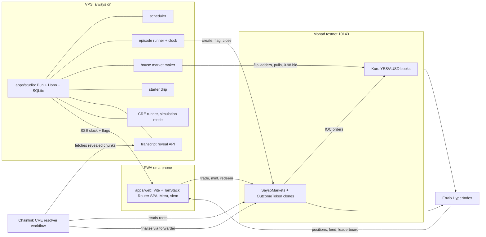
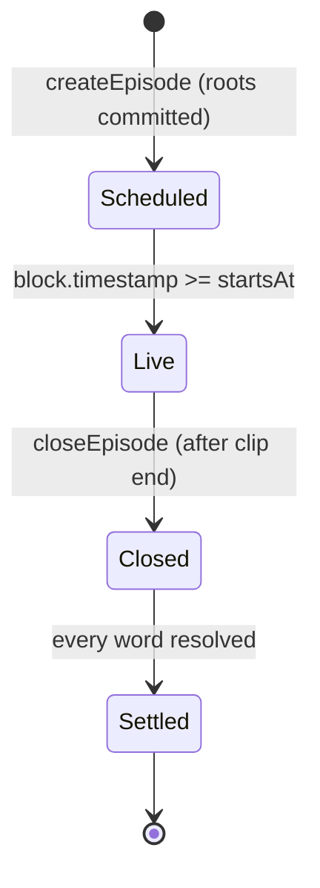
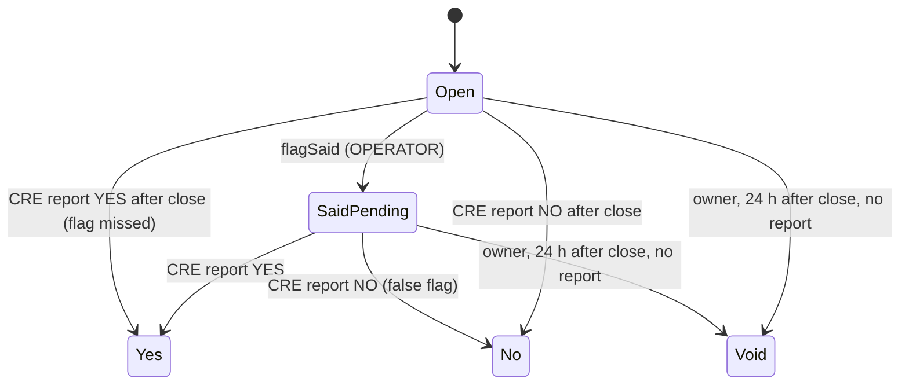

# Architecture

How SAYSO is built: components, boundaries, flows, the transcript commitment, the trust model, the pinned stack and how it runs. Product rules live in `docs/PRD.md`; external interfaces in `INTEGRATIONS.md`; contract surface in `SMART-CONTRACTS.md`; schemas in `ERD.md`.

Labels: **[V]** verified with source, **[I]** inference, **[U]** unverified with the settling spike.

## 1. Shape



Chain is truth. Envio and SQLite are read models; nothing a player owns lives only off chain.

## 2. Repo layout

```
apps/web/            PWA: screens, Mera session, signing, tx sequencing
apps/studio/         Bun + Hono service: scheduler, runner, market maker, drip, reveal API, CRE runner
packages/core/       Pure TypeScript shared by web, studio and CRE: matcher, chunking, Merkle,
                     price math, ABIs, addresses, types. No I/O, no React.
contracts/           Foundry: SaysoMarkets, OutcomeToken, scripts, tests
cre/resolver/        CRE TypeScript workflow: log triggers, HTTP fetch, proof checks, report
indexer/             Envio HyperIndex config, schema, handlers
tools/transcribe/    Offline transcription pipeline: two engines -> chunks -> roots
clips/manifest/      Tracked clip metadata (licence, duration, words); media is ignored
docs/                PRD, LESSONS, technical/*
.claude/skills/      Tracked project skills
```

Bun workspaces: `apps/*`, `packages/*`, `cre/*`, `indexer`, `tools/*`.

## 3. Components and boundaries

| Component | Owns | Never does |
|---|---|---|
| `apps/web` | Screens, Mera passkey session, signing, transaction sequencing by block, SSE subscription | Hold a key outside the Mera session; compute settlement |
| `apps/studio` | Episode schedule, playback clock, flags, house quotes, starter drip, chunk reveal, simulation-mode CRE runs, health | Sign for a player; finalize a word; reveal a chunk before its end time |
| `packages/core` | `matchWord`, `chunkTranscript`, `leafHash`, `merkleRoot`, `merkleProof`, price/size conversions, ABIs | Network, clocks, randomness |
| `contracts` | Collateral, outcome tokens, episode and word state, trade entry points, CRE receiver | Store transcripts; trust the studio for outcomes |
| `cre/resolver` | Proof verification, matcher run, outcome report | Hold player funds; read anything but the roots and revealed chunks |
| `indexer` | Episodes, words, trades, positions, profit, leaderboard | Feed back into settlement |
| `tools/transcribe` | Two independent transcripts per clip, chunk files, roots | Run in production request paths |

Three studio keys, each its own nonce stream: **OPERATOR** (create, flag, close), **BOT** (Kuru quotes), **DRIP** (starter balances). Separate senders keep one stream's pending transaction from delaying another under Monad's reserve-balance rule [V: [reserve balance](https://docs.monad.xyz/developer-essentials/reserve-balance)].

## 4. State machines





A word is tradable while its episode is Scheduled or Live and the word is Open or SaidPending. Set minting stops at Closed. Void redeems YES and NO at 0.5 AUSD each.

## 5. Flows

### 5.1 Create an episode

1. Studio picks the next clip (on-demand request or the hourly slot), loads its two chunk sets and roots from SQLite.
2. OPERATOR calls `createEpisode(clipId, rootA, rootB, startsAt, endsAt, words)`. The contract clones YES and NO tokens per word and deploys one Kuru YES/AUSD market per word through `Router.deployProxy` type 0.
3. BOT mints complete sets for inventory and provisions a flip ladder around 0.50 on each book with `batchProvisionLiquidity`.
4. Studio pushes the schedule over SSE; web shows the countdown.

### 5.2 Trade

All player trades go through `SaysoMarkets`, so one AUSD approval (or ERC-2612 permit) covers every word, and the contract emits one `Traded` event per fill for exact profit accounting.

- **Buy YES:** pull AUSD, `placeAndExecuteMarketBuy` on the word's book (IOC), send YES to the player.
- **Sell YES / cash out:** pull YES (the contract is the token's trusted spender), `placeAndExecuteMarketSell`, send AUSD.
- **Buy NO:** pull `n` AUSD, mint `n` sets, sell `n` YES with a minimum out, send `n` NO plus the sale proceeds.
- **Sell NO:** buy `n` YES with pooled collateral inside the call, burn `n` sets, repay, send the remainder; the collateral invariant is checked at the end of the call.

Kuru's non-margin settlement path for contract callers is spike S3 [U].

### 5.3 SAID flag (instant)

1. The episode clock reaches a spoken timestamp `t` that both engines agree on.
2. BOT sends `batchCancelFlipOrders` for that word, then a 0.98 bid sized to players' outstanding YES.
3. OPERATOR sends `flagSaid(wordId, chunkIndex, offsetMs)`. The card flips on every phone from the `WordFlagged` log and the SSE echo, whichever lands first.
4. The studio serves that chunk and its proofs from the reveal API from this moment.

Players watch with a fixed 1.5 s presentation delay behind the studio clock, so the pull and the flag land before any player hears the word. One-block inclusion is about 300 ms [V: [current facts](https://docs.monad.xyz/ai/current-facts.md)].

### 5.4 Settlement (CRE)

- **YES path.** A `WordFlagged` log triggers the workflow. It reads both roots from the contract, fetches the revealed chunk for each engine, verifies each proof, runs `matchWord` on both, and reports `(episodeId, [wordId], [YES or NO], evidenceHash)`.
- **NO path.** `EpisodeClosed` triggers the workflow. With every chunk revealed, it verifies both complete chunk sets against the roots, runs the matcher over the full transcript for each unresolved word, and reports all outcomes in one report.
- The report reaches `SaysoMarkets.onReport` only through the configured forwarder; the contract also checks the expected workflow ID.

Until deploy access is granted, the studio CRE runner invokes `cre workflow simulate --broadcast` for each trigger; reports then arrive through the simulation forwarder. Each settlement records its mode (`don` or `simulation`) and the README reports which mode produced it.

### 5.5 Redeem

After a word settles, the winning token redeems 1 AUSD per unit; the losing token redeems nothing; Void pays 0.5 per unit on both sides. BOT redeems house inventory after every episode to recycle AUSD.
