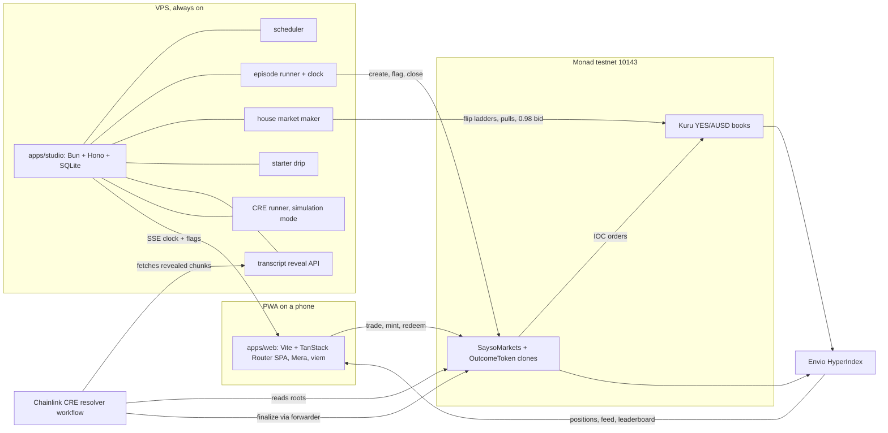
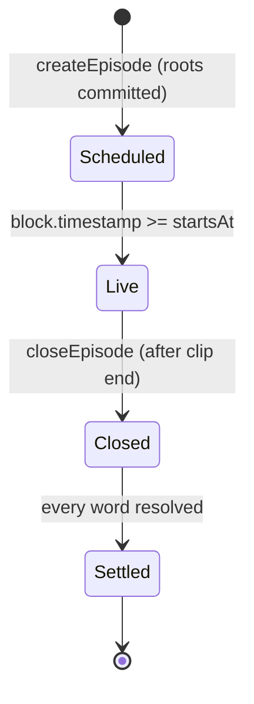
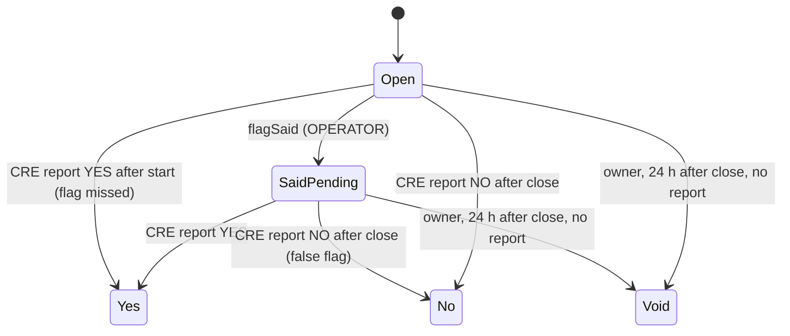

# Architecture

How SAYSO is built: components, boundaries, flows, the transcript commitment, the trust model, the pinned stack and how it runs. Product rules live in `docs/PRD.md`; external interfaces in `INTEGRATIONS.md`; contract surface in `SMART-CONTRACTS.md`; schemas in `ERD.md`.

Labels: **[V]** verified with source, **[I]** inference, **[U]** unverified with the settling spike.

## 1. Shape



Chain is truth. Envio and SQLite are read models; nothing a player owns lives only off chain.

## 2. Repo layout

Status column: **built** means tracked code exists today; a phase number means the folder arrives in that BUILD-PLAN phase.

```
packages/core/       built     Pure TypeScript shared by web, studio and CRE. No I/O, no React.
  src/               built       match, transcript, merkle, units, nickname, addresses, explorer;
                                 one *.test.ts beside each module; index.ts is the only entry
  abi/               built       vendored Kuru ABIs (kuru.ts) + SOURCE.md; sayso.ts generated from forge artifacts
  scripts/           built       vendor-kuru-abi, export-merkle-vectors, check-addresses
contracts/           built     Foundry (Soldeer deps): unit, fork (MONAD_FORK=1) and Merkle vector tests;
                               src/ SaysoMarkets, OutcomeToken, KuruTrade, vendor/chainlink; script/Deploy.s.sol
tools/transcribe/    built     Offline pipeline: two engines -> chunks -> roots -> flag plan (Bun CLI + vosk/ uv project)
clips/fixtures/      built     One tracked fixture clip (manifest + chunks, no media) for tests;
                               real clips, manifests and transcripts stay untracked studio data
cre/resolver/        built     CRE TypeScript workflow: log triggers, HTTP fetch, proof checks, report
apps/studio/         built     Bun + Hono: SQLite, reveal, scheduler/flags/SSE, permanent house maker, starter drip and receipt-backed CRE runner; funded live acceptance pending
indexer/             built     Envio config, schema and cashflow/position handlers; live sync and hosting gated by deploy
apps/web/            phase 7   PWA: S0 landing, screens S1–S8, Mera session, signing, tx sequencing;
                               assets-src/ voxel and logo sources, public/sfx/ mastered sound effects
tools/sfx/           phase 7   Offline ElevenLabs sound-effect generation + ffmpeg mastering (DESIGN section 10)
deploy/              phase 5   systemd unit and Caddy config
docs/                built     PRD, DESIGN, BLOCKERS, LESSONS; technical/ ARCHITECTURE, BUILD-PLAN,
                               SMART-CONTRACTS, ERD, INTEGRATIONS
.claude/skills/      built     Vendored + project skills (skills-lock.json pins sources)
.omp/agents/         built     Persona subagents: visual-designer, sound-engineer
```

Bun workspaces: `apps/*`, `packages/*`, `cre/*`, `tools/*`, `indexer`. Envio 3.12.1's CLI native addon requires Linux or macOS; Windows development runs indexer codegen and full `bun run verify` under WSL, not a skipped indexer script.

## 3. Components and boundaries

| Component | Owns | Never does |
|---|---|---|
| `apps/web` | Screens, Mera passkey session, signing, transaction sequencing by block, SSE subscription | Hold a key outside the Mera session; compute settlement |
| `apps/studio` | Episode schedule, playback clock, flags, house quotes, starter drip, chunk reveal, simulation-mode CRE runs, health | Sign for a player; finalize a word; reveal a chunk before its reveal time (section 6) |
| `packages/core` | `normalizeToken`, `matchesTarget`, `agreedSpokenTime`, `chunkTranscript`, `leafHash`, `merkleRoot`, `merkleProof`, `nicknameOf`, price/size conversions, gas table, ABIs | Network, clocks, randomness |
| `contracts` | Collateral, outcome tokens, episode and word state, trade entry points, CRE receiver | Store transcripts; trust the studio for outcomes |
| `cre/resolver` | Proof verification, matcher run, outcome report | Hold player funds; read anything but the roots and revealed chunks |
| `indexer` | Episodes, words, trades, positions, profit, leaderboard | Feed back into settlement |
| `tools/transcribe` | Two independent transcripts per clip, chunk files, roots | Run in production request paths |

Four distinct studio senders, each its own nonce stream: **OPERATOR** (create, flag, close), **BOT** (Kuru quotes), **DRIP** (starter balances), **REPORTER** (simulation forwarder writes). Config rejects duplicate role addresses. Transactions persist signed bytes/hash before broadcast and wait for a strictly later block after the prior receipt; unknown outcomes recover the identical bytes, never release the sender by elapsed time. Separate senders isolate Monad reserve-balance constraints [V: [reserve balance](https://docs.monad.xyz/developer-essentials/reserve-balance)].

## 4. State machines





A listed word trades while it is Open or SaidPending, including after episode close: YES buys/sells and NO sells remain allowed until finalization. Closing stops new complete sets (`mintSet`, permit mint and `buyNo`), not transfers or `burnSet`. Void redeems each side at `floor(amount / 2)` base units per call.

## 5. Flows

### 5.1 Create an episode

1. Studio picks the next clip (on-demand request or the hourly slot), loads its two chunk sets and roots from SQLite.
2. OPERATOR calls `createEpisode(clipId, rootA, rootB, startsAt, endsAt, words)`, which clones YES and NO tokens per word, then `listEpisode(episodeId)`, which deploys one Kuru YES/AUSD market per word through `Router.deployProxy` type 0.
3. BOT mints complete sets for inventory and provisions a flip ladder around 0.50 on each book with `batchProvisionLiquidity`.
4. Studio pushes the schedule over SSE; web shows the countdown.

### 5.2 Trade

All player trades go through `SaysoMarkets`, so one AUSD approval (or ERC-2612 permit) covers every word, and the contract emits one `Traded` event per fill for exact profit accounting.

- **Buy YES:** pull AUSD, `placeAndExecuteMarketBuy` on the word's book (IOC), send YES to the player.
- **Sell YES / cash out:** pull YES (the contract is the token's trusted spender), `placeAndExecuteMarketSell`, send AUSD.
- **Buy NO:** mint `n` sets against pooled collateral, sell all `n` YES (a partial fill reverts), send `n` NO, then pull only `n − proceeds` AUSD from the player.
- **Sell NO:** buy at least `n` YES with pooled collateral, sized by walking the book's asks, burn `n` sets, pay `n − cost`, return rounding dust YES; the collateral invariant (`AUSD balance >= totalSets`) is checked at the end of the call.

Kuru's non-margin settlement for a contract caller is verified on a fork (the contract approves the book only; fills move wallet to wallet); the live testnet run is still open [`INTEGRATIONS.md` section 2, S2+S3]. Exact rules are in `SMART-CONTRACTS.md` sections 3 and 6.

### 5.3 SAID flag (instant)

1. The studio knows every agreed spoken timestamp `t` in advance (replay clips, section 6).
2. At `t − 400 ms`, BOT pulls actual active flip orders, including replacement IDs. At or after `t`, only after cancellation confirmation and chain SAID, it posts the 0.98 bid sized from non-house Envio YES. The committed indexer progress must include the pull receipt, remain within ten head blocks and stay stable through pagination; missing/stale reads leave the bid pending. Size is capped by house spendable AUSD and Kuru bounds.
3. At `t`, OPERATOR sends `flagSaid(wordId, chunkIndexA, chunkIndexB, offsetMs)`.
4. Phones receive the `WordFlagged` log or the SSE echo, whichever lands first, and flip the card at the player's presentation time `t + 1.5 s`, so the flip lands on the spoken word.

Players watch with a fixed 1.5 s presentation delay behind the studio clock. The planned pull is one block before the flag; actual inclusion and cash-out readiness require runtime measurement, not a timing guarantee. One-block inclusion is about 300 ms [V: [current facts](https://docs.monad.xyz/ai/current-facts.md)]. OPERATOR flags do not await BOT or CRE background work. Players only send immediate-or-cancel orders, so after a confirmed pull no house ask remains for an early chain-watcher to lift.

### 5.4 Settlement (CRE)

- **YES path.** At each chunk boundary, OPERATOR batches `markEvidence(episodeId, wordIds)` for flagged words whose chunks are now revealed. The `EvidenceReady` log triggers the workflow: it reads both roots from the contract, fetches the revealed chunks for each engine, verifies every proof, runs `agreedSpokenTime` on the verified tokens, and reports `(episodeId, wordIds, outcomes, evidenceHash)`. YES finality is therefore at most one chunk (10 s) plus the reveal margin plus CRE latency after the word.
- **NO path.** `EpisodeClosed` triggers the workflow. With every chunk revealed, it verifies both complete chunk sets against the roots, runs the matcher over the full transcript for each unresolved word, and reports all outcomes in one report.
- The report reaches `SaysoMarkets.onReport` only through the configured forwarder; the contract also checks the expected workflow ID.

Until deploy access is granted, the studio CRE runner invokes `cre workflow simulate --broadcast` for each trigger; reports then arrive through the simulation forwarder. Each settlement records its mode (`don` or `simulation`) and the README reports which mode produced it.

Simulation trigger discovery recovers confirmed action receipts and catches up canonical logs from `SAYSO_START_BLOCK`. Receipt-array log index selects the exact trigger. Success is corroborated from actual forwarder/receiver receipts and the durable REPORTER nonce, never stdout hashes. The resolver emits a bounded structured pre-write no-report marker only before report submission: a legitimate false flag releases the queue for close; a pre-write capability failure backs off safely. Interrupted/failed write execution without proof remains ambiguous and gates REPORTER until onchain reconciliation.

### 5.5 Redeem

After a word settles, the winning token redeems 1 AUSD per unit; the losing token redeems nothing; Void pays 0.5 per unit on both sides. BOT redeems house inventory after every episode to recycle AUSD.

## 6. Transcript commitment

The outcome of every word is fixed before the first trade and provable afterwards.

1. `tools/transcribe` runs two independent engines on the clip: whisper.cpp (engine A) and Vosk (engine B). Both emit word-level timestamps.
2. Tokens are normalized by `packages/core` (`normalizeToken`) into `[word, startMs, endMs]`, where both times are non-negative safe integers with `startMs <= endMs`; anything else is refused before hashing, because JSON would turn `NaN` or `Infinity` into `null`.
3. Tokens are grouped into 10,000 ms chunks by start time. Chunk `i` covers `[10000·i, 10000·(i+1))`. Every index from 0 to `ceil(duration / 10,000) − 1` exists, empty chunks included, so the NO path can prove a complete set.
4. `leaf = keccak256(abi.encode(clipId, engine, index, startMs, endMs, tokensHash))`; ABI types are `(bytes32 clipId, uint8 engine (A = 0, B = 1), uint32 index, uint64 startMs, uint64 endMs, bytes32 tokensHash)`. `tokensHash` is keccak256 of UTF-8 canonical JSON `[["word",start,end],...]` with no whitespace.
5. Each engine's leaves stay in chunk order and form a Merkle tree with commutative keccak pair hashing, the same scheme as OpenZeppelin `MerkleProof`; an odd node is promoted unchanged. `rootA` and `rootB` go onchain in `createEpisode`.
6. `clipId = keccak256(sha256(media file) ‖ manifestId)`: the raw 32-byte digest followed by the UTF-8 manifest id (`encodePacked(bytes32, string)`), not the digest's hex text. Anyone holding the media can rerun the pinned engines and audit both transcripts.
7. **Reveal schedule.** The reveal API serves chunk `i` with its proof only after studio time passes `startsAt + chunkEnd + 2,000 ms` (presentation delay plus margin). After `closeEpisode`, every chunk is public.

**Clock boundaries:** onchain `endsAt − startsAt = ceil(mediaDurationMs / 1000)` seconds, preserving the committed chunk count the CRE resolver derives. The studio closes at `endsAt + 2,000 ms`, not before the delayed player hears the final word. After a late restart, an Open word whose flag window elapsed stays Open for CRE's full-transcript close decision; the studio records the missed action instead of submitting an impossible flag.

Agreement rule: a word is said when both engines contain a matching token whose start times differ by at most 1,500 ms. The agreed spoken timestamp `t` is the earlier start. The flag schedule is computed offline from this rule.

## 7. Clock and playback

- Studio time is authoritative. `GET /v1/time` returns server milliseconds; the web estimates its offset from five pings and keeps the lowest round trip.
- The player computes `position = now + offset − startsAt − 1,500 ms` and seeks there. Drift above 250 ms is corrected with small `playbackRate` changes; scrubbing is disabled.
- Media is a progressive MP4 served with range requests from the VPS.

## 8. Trust model

| Actor | Can | Cannot |
|---|---|---|
| OPERATOR | Choose clip and words (committed before trading), flag, mark evidence, close, stop quoting | Change a transcript after commit, finalize a word, touch collateral |
| Owner | Set forwarder, expected workflow ID and report origin (simulation to production), void a word 24 h after close with no report, pause new episodes | Withdraw collateral, finalize a word |
| CRE | Report outcomes through the forwarder | Report for a different workflow ID |
| REPORTER key | In simulation mode, send the simulator's report transaction; `SaysoMarkets` accepts simulation-forwarder reports only when `tx.origin` is this key | Settle anything in DON mode (`reportOrigin` is zero) |
| Studio service | Reveal chunks on schedule, drip starter balances | Sign for a player |

In simulation mode, CRE runs on a single local node and the HTTP fetch is single-node consensus [V: [HTTP capability](https://docs.chain.link/cre/capabilities/http)]. The simulation forwarder verifies no signatures, so the REPORTER gate is the only thing stopping a forged report; trust in that mode rests on the studio host that holds REPORTER (SMART-CONTRACTS section 7). Deployed workflows run BFT consensus across a DON. The README states the mode of each settlement.

## 9. Tech stack

Versions are the latest stable releases checked on 2026-10-05 (`npm view`, GitHub releases). Pin exact versions in `package.json` and `foundry.toml`; upgrade deliberately.

| Layer | Choice | Version |
|---|---|---|
| Runtime, installs | Bun | 1.3.14 |
| Vite and Vitest runtime | Node (the studio's Vitest runs inside Bun for `bun:sqlite`) | 24.21.0 |
| Language | TypeScript | 7.0.2 |
| UI | React | 19.3.0 |
| Build | Vite, `@vitejs/plugin-react` | 8.3.3, 6.1.2 |
| Routing | `@tanstack/react-router`, `@tanstack/router-plugin` | 1.170.41, 1.168.42 |
| Server state | `@tanstack/react-query` | 5.104.1 |
| Client state | zustand | 5.0.15 |
| Styling | Tailwind CSS | 4.3.3 |
| Motion | motion | 14.0.0 |
| 3D (S0 hero, S5 win only) | three, `@react-three/fiber`, three-stdlib | 0.186.1, 9.8.1, 2.36.1 |
| Fonts | `@fontsource-variable/bricolage-grotesque`, `@fontsource-variable/inter` | 5.3.0, 5.3.0 |
| UI icons | lucide-react | 1.52.0 |
| Image build | sharp (voxel WebP) | 0.35.5 |
| Sound build | ElevenLabs `POST /v1/sound-generation` (`eleven_text_to_sound_v2`), ffmpeg | API, 8.1.2 |
| PWA | vite-plugin-pwa | 2.0.0 |
| Validation | zod | 4.6.5 |
| Chain I/O | viem | 2.57.2 |
| Accounts | `@category-labs/mera`, `@scure/bip32`, `@scure/bip39` | 0.2.0, 2.4.0, 2.4.0 |
| Studio API | Hono on Bun, `bun:sqlite` | 4.13.13 |
| Contracts | Foundry, Solidity, OpenZeppelin Contracts | 1.8.4, 0.8.37, 5.7.0 |
| Settlement | CRE CLI, `@chainlink/cre-sdk` | 1.36.0, 1.23.0 |
| Indexer | Envio HyperIndex | 3.12.1 |
| Transcription | whisper.cpp (`ggml-base.en`), Vosk (`vosk-model-en-us-0.22`) | 1.9.4, 0.3.45 (latest published wheel; 0.3.50 is a source-only tag, S7) |
| Lint and format | Biome | 2.5.15 |
| Tests | Vitest, Playwright | 5.0.3, 1.63.0 |

**Why a router-only SPA.** The web app is static files: TanStack Router gives type-safe routes and loaders in the browser, and everything dynamic comes from the chain, Envio and the studio. TanStack Start adds server rendering and server functions, which need a request-scoped server; SAYSO's server work is long-running (clocks, quotes, reveals), so it lives in the studio. The SPA ships from any static host.

No ethers: Kuru's published SDK depends on ethers v5, so only its ABIs are vendored into `packages/core`.

## 10. Runtime and hosting

| Piece | Where | Notes |
|---|---|---|
| `apps/web` | Static files behind Caddy on the VPS | The domain is the passkey relying-party ID and must never change after the first real passkey |
| `apps/studio` | Bun under systemd on the VPS | Must run 24/7 through judging (14 to 27 Oct 2026) |
| Clip media, manifests, transcripts | Private studio data; explicitly published MP4s in `/srv/sayso/media` | Caddy never serves the studio tree; chunks public only through the reveal API |
| Indexer | Envio hosted service or self-hosted on the VPS | Spike S6 |
| CRE | Deployed DON workflow, else studio-run simulation | Deploy access requested with `cre account access` |
| RPC | `https://testnet-rpc.monad.xyz` | Public endpoint; a provider key is optional |

Environment (`.env.example` lists every key): `RPC_URL`, `CHAIN_ID=10143`, `DEPLOYER_PK` (contract deploys only), `OPERATOR_PK`, `BOT_PK`, `DRIP_PK`, `REPORTER_PK` (signs simulated CRE reports; the only key `reportOrigin` accepts), `OPERATOR_ADDRESS` and `REPORTER_ADDRESS` (public addresses `Deploy.s.sol` wires), `SAYSO_MARKETS`, `AUSD`, `KURU_ROUTER`, `CRE_MODE=simulation|don`, `STUDIO_DATA_DIR` (outside the repo: `studio.sqlite` plus `clips/<id>/` transcribe output, ingested at start), `PORT=3001`, `VITE_RP_ID`, `VITE_STUDIO_URL`, `VITE_INDEXER_URL`, and the offline transcription paths `WHISPER_CLI`, `WHISPER_MODEL`, `VOSK_MODEL`, optional `VOSK_PYTHON_PROJECT`. Studio role keys and `SAYSO_MARKETS` may be absent while only the read API runs; loaded keys live in private fields and never appear in logs, JSON or `/v1/health`.

Studio execution additionally uses `INDEXER_URL`, `STUDIO_REVEAL_URL`, `SAYSO_START_BLOCK`, optional `CRE_RESOLVER_DIR`, `CRE_CLI_PATH`, and a private stable `DRIP_IP_SALT` (at least 32 characters, hidden from inspection). Missing maker configuration keeps episode admission unavailable; missing drip configuration keeps claims unavailable. CRE starts only after the reveal HTTP server listens. Shutdown stops admissions and drains every writer before SQLite closes.

Deployment authentication is mandatory before broadcast: simulation requires nonzero `REPORTER_ADDRESS`; DON requires nonzero `CRE_WORKFLOW_ID` for the approved resolver and installs it before enabling the operator. A forwarder alone does not bind a DON report to SAYSO.

### Deployment layout and procedure

`deploy/sayso-studio.service` runs Bun as the dedicated `sayso` account with private state, read-only system/home, no elevated capabilities and a 180-second shutdown drain. It forces port 3001, loopback-only proxy mode, `/var/lib/sayso` data and a writable `/var/lib/sayso/resolver` workflow. Source/dependencies remain read-only; CRE compilation must not write into `/opt/sayso`.

| Path | Access and purpose |
|---|---|
| `/opt/sayso` | Root-owned checkout and frozen dependencies, readable by studio; not writable by it |
| `/etc/sayso/studio.env` | Root-owned mode 0600, read by systemd; studio roles/config only, no DEPLOYER key |
| `/var/lib/sayso` | `sayso:sayso` mode 0700; SQLite/WAL, clips, private transcripts/flag plans, CRE login/cache |
| `/var/lib/sayso/resolver` | Writable workflow/config/build outputs; `node_modules` symlink to `/opt/sayso/cre/resolver/node_modules` |
| `/srv/sayso/web` | Published Phase 7 build only; root-owned, Caddy-readable; no synthetic smoke page ships |
| `/srv/sayso/media` | Published MP4s only, named `<0x-lowercase-64-hex-clip-id>.mp4`; root-owned, Caddy-readable |
| `/etc/sayso/caddy.env` | Public `SAYSO_DOMAIN` only; never role keys or studio environment |

Prepare on the approved Linux host after B05/B06:

1. Install verified Bun 1.3.14, Node 24.21.0, CRE CLI 1.36.0 and Caddy; Caddy 2.11.7 is the locally exercised version ([release](https://github.com/caddyserver/caddy/releases/tag/v2.11.7)). Put Bun/CRE/Node on the unit's `/usr/local/bin:/usr/bin:/bin` path. Install the official Caddy service/account.
2. Create the dedicated non-login `sayso` account, root-owned `/opt/sayso` checkout and frozen dependencies. Prepare `/etc/sayso` mode 0700 and `/var/lib/sayso` owned by `sayso`, mode 0700. Keep public web/media roots separate and non-writable by studio.
3. Provision `/etc/sayso/studio.env` locally, mode 0600. Include verified receiver/start block, funded distinct OPERATOR/BOT/DRIP/REPORTER, stable drip salt, indexer/reveal URLs and mode. No DEPLOYER key. No credentials in git, CLI arguments or logs.
4. Copy resolver `src/`, `project.yaml`, `workflow.yaml`, `package.json` and deployment-populated `config.monad-testnet.json` to `/var/lib/sayso/resolver`; install `deploy/resolver.tsconfig.json` there as `tsconfig.json` and symlink `node_modules` to the checkout's resolver dependencies. Own the copied files by `sayso`. The runtime config retains strict typechecking while fixing relocated include/extends paths. Perform authenticated CRE login as that user with `HOME=/var/lib/sayso`; never rely on root's login. Verify a non-broadcast staged run before enabling autonomous episodes.
5. Publish only rights-cleared, final encoded MP4s matching committed `media_sha256`; use their clip ID as the public filename. Do not symlink public roots into private data. Place the actual Phase 7 web build in the public web root; it is not built yet.
6. Set the permanent domain in `/etc/sayso/caddy.env` as `SAYSO_DOMAIN=<chosen hostname>` (no scheme, path or local test port); point DNS to the host and permit ports 80/443. Use that origin for the web, reveal URL and passkey relying-party ID.
7. Install the unit and Caddy drop-in:

```sh
sudo install -m 0644 /opt/sayso/deploy/sayso-studio.service /etc/systemd/system/
sudo install -d /etc/systemd/system/caddy.service.d
sudo install -m 0644 /opt/sayso/deploy/caddy.service.d/sayso.conf /etc/systemd/system/caddy.service.d/
sudo systemd-analyze verify /etc/systemd/system/sayso-studio.service
sudo systemctl daemon-reload
```

Validate Caddy with its public domain environment before `sudo systemctl restart caddy`; the drop-in selects `/opt/sayso/deploy/Caddyfile`. Start studio with `sudo systemctl enable --now sayso-studio`. Verify HTTPS time/health, a real MP4 range response, restart recovery and one fully funded/settled episode before calling deployment accepted. Restart studio after code/config changes; never hot-edit the resolver during an active simulation.

**Proxy boundary:** direct mode ignores identity headers. `STUDIO_BEHIND_CADDY=true` binds Bun to `127.0.0.1` and requires one valid `X-Sayso-Client-IP` from a loopback peer; missing/malformed identity returns 400. Caddy overwrites the header with its actual socket peer, so arbitrary `X-Forwarded-For`/`Forwarded` headers do not bypass IP limits. This assumes trusted local processes and Caddy directly facing users; do not add a CDN/remote proxy without revisiting the boundary. API responses are `no-store`; SSE flushes immediately. `/media/*` accepts only the exact opaque MP4 path; JSON/directories are 404.

Media ranges deliver prerecorded replay, not broadcaster restreaming, DRM or prevention of downloading the full clip. Recognizable clips remain a product risk (PRD §12); private transcript/flag-plan files never become static assets.

### Testnet MON budget

Testnet MON comes from a rate-limited faucet, so the plan is lean. Targets are [I] until S1 to S4 measure real gas; Monad charges the declared gas limit at a 100 gwei minimum base fee [V: monskills `gas`], so a 300k-gas call costs about 0.03 MON.

| Key | Target | Spends on |
|---|---|---|
| DEPLOYER | 10 MON | Contract deploys and market creation, once |
| OPERATOR | 15 MON | One `flagSaid` per word, evidence batches, closes |
| BOT | 15 MON | Cancel and re-post of the 0.98 bid; inventory is AUSD, not MON |
| DRIP | 60 MON | About 0.5 MON per new player, so roughly 120 players |
| REPORTER | 5 MON | One simulated report transaction per evidence batch and per close (about 0.03 MON each) |

About 105 MON in total. Players start with under 10 MON, so the web sends their transactions one block apart (the reserve-balance rule in the `mera-passkeys` skill) and each pays gas only. The drip handler refuses new drips when DRIP falls below one drip plus gas; the join flow still works and S2 shows the faucet links. S1 to S4 replace these targets with measured costs.

The initial starter grant is **0.5 testnet MON + 10 testnet AUSD**, once per normalized address and one new address per hour per canonical client IP, HMAC-hashed with the stable private salt. Both legs' maximum-fee budget and available AUSD are checked before sending; partial awards recover without a second native grant. Empty-code native recipients use 21,000 gas; code-bearing recipients require actual-call gas estimation. Direct mode uses the socket peer; explicitly enabled same-host Caddy mode uses the overwritten identity described above, never arbitrary forwarding headers.

## 11. Failure modes

| Failure | Behaviour |
|---|---|
| RPC errors | Studio retries with backoff and pauses the episode start; web shows the stale state with its age |
| Flag transaction late | The card still flips at presentation time from SSE; the chain flag follows; settlement is unaffected |
| Engines disagree on a word | No flag; the word resolves at close under the same agreement rule |
| CRE run fails | Studio retries the trigger; after 24 h with no report the owner may void |
| House inventory short | Episode start waits; lobby shows "restocking" |
| Starter drip empty | Join still works; S2 shows the faucet links |

## 12. Testing

- `packages/core`: unit tests for normalization, matching vectors, chunking, leaf and root vectors shared with Foundry.
- `contracts`: Foundry unit and invariant tests (collateral equals outstanding sets until redemption; no double resolution; only the forwarder settles).
- `cre/resolver`: workflow unit tests plus `cre workflow simulate` against testnet.
- `apps/studio`: episode runner against a local chain and recorded fixtures.
- `apps/web`: Playwright at a 412 px viewport for join, trade, flip, redeem, restore.
- Health: `GET /v1/health` reports chain head lag, key balances, house inventory, last CRE run and its mode.
