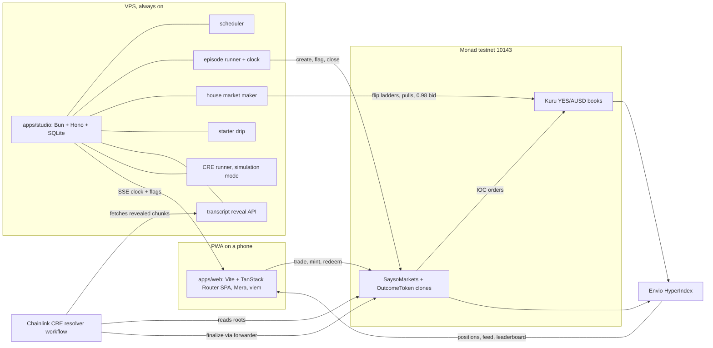
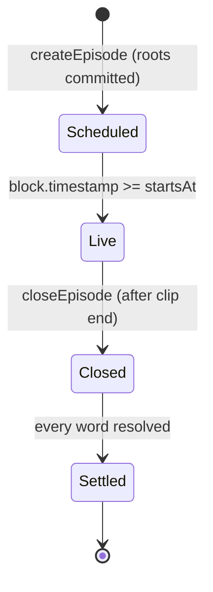
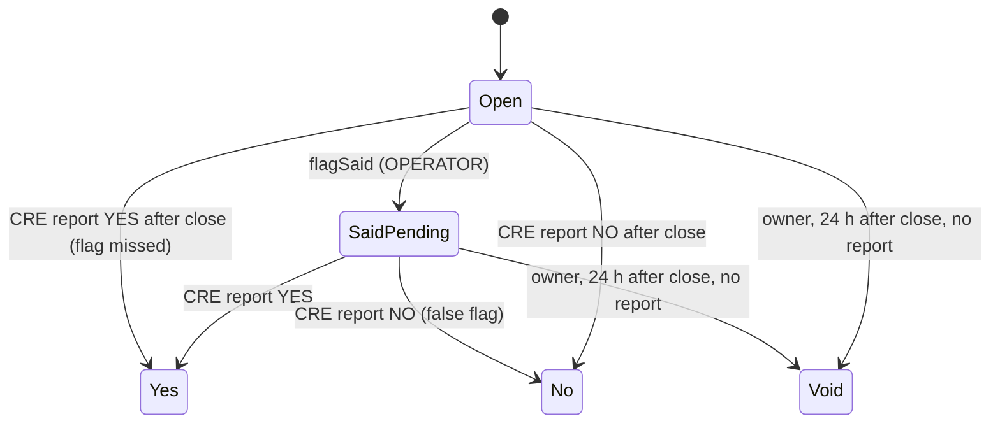

# Architecture

How SAYSO is built: components, boundaries, flows, the transcript commitment, the trust model, the pinned stack and how it runs. Product rules live in `docs/PRD.md`; external interfaces in `INTEGRATIONS.md`; contract surface in `SMART-CONTRACTS.md`; schemas in `ERD.md`.

Labels: **[V]** verified with source, **[I]** inference, **[U]** unverified with the settling spike.

## 1. Shape



Chain is truth. Envio and SQLite are read models; nothing a player owns lives only off chain.

## 2. Repo layout

```
apps/web/            PWA: screens, Mera session, signing, tx sequencing
apps/studio/         Bun + Hono service: scheduler, runner, market maker, drip, reveal API, CRE runner
packages/core/       Pure TypeScript shared by web, studio and CRE: matcher, chunking, Merkle,
                     price math, ABIs, addresses, types. No I/O, no React.
contracts/           Foundry: SaysoMarkets, OutcomeToken, scripts, tests
cre/resolver/        CRE TypeScript workflow: log triggers, HTTP fetch, proof checks, report
indexer/             Envio HyperIndex config, schema, handlers
tools/transcribe/    Offline transcription pipeline: two engines -> chunks -> roots
clips/manifest/      Tracked clip metadata (licence, duration, words); media is ignored
docs/                PRD, LESSONS, technical/*
.claude/skills/      Tracked project skills
```

Bun workspaces: `apps/*`, `packages/*`, `cre/*`, `indexer`, `tools/*`.

## 3. Components and boundaries

| Component | Owns | Never does |
|---|---|---|
| `apps/web` | Screens, Mera passkey session, signing, transaction sequencing by block, SSE subscription | Hold a key outside the Mera session; compute settlement |
| `apps/studio` | Episode schedule, playback clock, flags, house quotes, starter drip, chunk reveal, simulation-mode CRE runs, health | Sign for a player; finalize a word; reveal a chunk before its end time |
| `packages/core` | `matchWord`, `chunkTranscript`, `leafHash`, `merkleRoot`, `merkleProof`, price/size conversions, ABIs | Network, clocks, randomness |
| `contracts` | Collateral, outcome tokens, episode and word state, trade entry points, CRE receiver | Store transcripts; trust the studio for outcomes |
| `cre/resolver` | Proof verification, matcher run, outcome report | Hold player funds; read anything but the roots and revealed chunks |
| `indexer` | Episodes, words, trades, positions, profit, leaderboard | Feed back into settlement |
| `tools/transcribe` | Two independent transcripts per clip, chunk files, roots | Run in production request paths |

Three studio keys, each its own nonce stream: **OPERATOR** (create, flag, close), **BOT** (Kuru quotes), **DRIP** (starter balances). Separate senders keep one stream's pending transaction from delaying another under Monad's reserve-balance rule [V: [reserve balance](https://docs.monad.xyz/developer-essentials/reserve-balance)].

## 4. State machines





A word is tradable while its episode is Scheduled or Live and the word is Open or SaidPending. Set minting stops at Closed. Void redeems YES and NO at 0.5 AUSD each.

## 5. Flows

### 5.1 Create an episode

1. Studio picks the next clip (on-demand request or the hourly slot), loads its two chunk sets and roots from SQLite.
2. OPERATOR calls `createEpisode(clipId, rootA, rootB, startsAt, endsAt, words)`. The contract clones YES and NO tokens per word and deploys one Kuru YES/AUSD market per word through `Router.deployProxy` type 0.
3. BOT mints complete sets for inventory and provisions a flip ladder around 0.50 on each book with `batchProvisionLiquidity`.
4. Studio pushes the schedule over SSE; web shows the countdown.

### 5.2 Trade

All player trades go through `SaysoMarkets`, so one AUSD approval (or ERC-2612 permit) covers every word, and the contract emits one `Traded` event per fill for exact profit accounting.

- **Buy YES:** pull AUSD, `placeAndExecuteMarketBuy` on the word's book (IOC), send YES to the player.
- **Sell YES / cash out:** pull YES (the contract is the token's trusted spender), `placeAndExecuteMarketSell`, send AUSD.
- **Buy NO:** pull `n` AUSD, mint `n` sets, sell `n` YES with a minimum out, send `n` NO plus the sale proceeds.
- **Sell NO:** buy `n` YES with pooled collateral inside the call, burn `n` sets, repay, send the remainder; the collateral invariant is checked at the end of the call.

Kuru's non-margin settlement path for contract callers is spike S3 [U].

### 5.3 SAID flag (instant)

1. The studio knows every agreed spoken timestamp `t` in advance (replay clips, section 6).
2. At `t − 400 ms`, BOT sends `batchCancelFlipOrders` for that word, then posts the 0.98 bid sized to players' outstanding YES.
3. At `t`, OPERATOR sends `flagSaid(wordId, chunkIndexA, chunkIndexB, offsetMs)`.
4. Phones receive the `WordFlagged` log or the SSE echo, whichever lands first, and flip the card at the player's presentation time `t + 1.5 s`, so the flip lands on the spoken word.

Players watch with a fixed 1.5 s presentation delay behind the studio clock. The pull lands one block before the flag, and both land before any player hears the word. One-block inclusion is about 300 ms [V: [current facts](https://docs.monad.xyz/ai/current-facts.md)]. Players only send immediate-or-cancel orders, so after the pull no ask rests on that book for an early chain-watcher to lift.

### 5.4 Settlement (CRE)

- **YES path.** At each chunk boundary, OPERATOR batches `markEvidence(episodeId, wordIds)` for flagged words whose chunks are now revealed. The `EvidenceReady` log triggers the workflow: it reads both roots from the contract, fetches the revealed chunks for each engine, verifies every proof, runs `matchWord` on both, and reports `(episodeId, wordIds, outcomes, evidenceHash)`. YES finality is therefore at most one chunk (10 s) plus the reveal margin plus CRE latency after the word.
- **NO path.** `EpisodeClosed` triggers the workflow. With every chunk revealed, it verifies both complete chunk sets against the roots, runs the matcher over the full transcript for each unresolved word, and reports all outcomes in one report.
- The report reaches `SaysoMarkets.onReport` only through the configured forwarder; the contract also checks the expected workflow ID.

Until deploy access is granted, the studio CRE runner invokes `cre workflow simulate --broadcast` for each trigger; reports then arrive through the simulation forwarder. Each settlement records its mode (`don` or `simulation`) and the README reports which mode produced it.

### 5.5 Redeem

After a word settles, the winning token redeems 1 AUSD per unit; the losing token redeems nothing; Void pays 0.5 per unit on both sides. BOT redeems house inventory after every episode to recycle AUSD.

## 6. Transcript commitment

The outcome of every word is fixed before the first trade and provable afterwards.

1. `tools/transcribe` runs two independent engines on the clip: whisper.cpp (engine A) and Vosk (engine B). Both emit word-level timestamps.
2. Tokens are normalized by `packages/core` (`normalizeToken`) into `[word, startMs, endMs]`.
3. Tokens are grouped into 10,000 ms chunks by start time. Chunk `i` covers `[10000·i, 10000·(i+1))`.
4. `leaf = keccak256(abi.encode(clipId, engine, i, startMs, endMs, keccak256(canonicalJson(tokens))))`; canonical JSON is `[["word",start,end],...]` with no whitespace.
5. Each engine's leaves form a Merkle tree with commutative keccak pair hashing, the same scheme as OpenZeppelin `MerkleProof`. `rootA` and `rootB` go onchain in `createEpisode`.
6. `clipId = keccak256(sha256(media file) ‖ manifestId)`. Anyone holding the media can rerun the pinned engines and audit both transcripts.
7. **Reveal schedule.** The reveal API serves chunk `i` with its proof only after studio time passes `startsAt + chunkEnd + 2,000 ms` (presentation delay plus margin). After `closeEpisode`, every chunk is public.

Agreement rule: a word is said when both engines contain a matching token whose start times differ by at most 1,500 ms. The agreed spoken timestamp `t` is the earlier start. The flag schedule is computed offline from this rule.

## 7. Clock and playback

- Studio time is authoritative. `GET /v1/time` returns server milliseconds; the web estimates its offset from five pings and keeps the lowest round trip.
- The player computes `position = now + offset − startsAt − 1,500 ms` and seeks there. Drift above 250 ms is corrected with small `playbackRate` changes; scrubbing is disabled.
- Media is a progressive MP4 served with range requests from the VPS.

## 8. Trust model

| Actor | Can | Cannot |
|---|---|---|
| OPERATOR | Choose clip and words (committed before trading), flag, mark evidence, close, stop quoting | Change a transcript after commit, finalize a word, touch collateral |
| Owner | Set forwarder and expected workflow ID (simulation to production), void a word 24 h after close with no report, pause new episodes | Withdraw collateral, finalize a word |
| CRE | Report outcomes through the forwarder | Report for a different workflow ID |
| Studio service | Reveal chunks on schedule, drip starter balances | Sign for a player |

In simulation mode, CRE runs on a single local node and the HTTP fetch is single-node consensus [V: [HTTP capability](https://docs.chain.link/cre/capabilities/http)]. Deployed workflows run BFT consensus across a DON. The README states the mode of each settlement.

## 9. Tech stack

Versions are the latest stable releases checked on 2026-10-05 (`npm view`, GitHub releases). Pin exact versions in `package.json` and `foundry.toml`; upgrade deliberately.

| Layer | Choice | Version |
|---|---|---|
| Runtime, installs | Bun | 1.3.14 |
| Vite and Vitest runtime | Node | 24.21.0 |
| Language | TypeScript | 7.0.2 |
| UI | React | 19.3.0 |
| Build | Vite, `@vitejs/plugin-react` | 8.3.2, 6.1.1 |
| Routing | `@tanstack/react-router`, `@tanstack/router-plugin` | 1.170.41, 1.168.42 |
| Server state | `@tanstack/react-query` | 5.104.1 |
| Client state | zustand | 5.0.15 |
| Styling | Tailwind CSS | 4.3.3 |
| Motion | motion | 14.0.0 |
| PWA | vite-plugin-pwa | 2.0.0 |
| Validation | zod | 4.6.5 |
| Chain I/O | viem | 2.57.2 |
| Accounts | `@category-labs/mera`, `@scure/bip32`, `@scure/bip39` | 0.2.0, 2.4.0, 2.4.0 |
| Studio API | Hono on Bun, `bun:sqlite` | 4.13.13 |
| Contracts | Foundry, Solidity, OpenZeppelin Contracts | 1.8.4, 0.8.37, 5.7.0 |
| Settlement | CRE CLI, `@chainlink/cre-sdk` | 1.36.0, 1.23.0 |
| Indexer | Envio HyperIndex | 3.12.1 |
| Transcription | whisper.cpp, Vosk | 1.9.4, 0.3.50 |
| Lint and format | Biome | 2.5.15 |
| Tests | Vitest, Playwright | 5.0.3, 1.63.0 |

**Why a router-only SPA.** The web app is static files: TanStack Router gives type-safe routes and loaders in the browser, and everything dynamic comes from the chain, Envio and the studio. TanStack Start adds server rendering and server functions, which need a request-scoped server; SAYSO's server work is long-running (clocks, quotes, reveals), so it lives in the studio. The SPA ships from any static host.

No ethers: Kuru's published SDK depends on ethers v5, so only its ABIs are vendored into `packages/core`.

## 10. Runtime and hosting

| Piece | Where | Notes |
|---|---|---|
| `apps/web` | Static files behind Caddy on the VPS | The domain is the passkey relying-party ID and must never change after the first real passkey |
| `apps/studio` | Bun under systemd on the VPS | Must run 24/7 through judging (14 to 27 Oct 2026) |
| Clip media | Caddy static with range requests | Ignored by git |
| Indexer | Envio hosted service or self-hosted on the VPS | Spike S6 |
| CRE | Deployed DON workflow, else studio-run simulation | Deploy access requested with `cre account access` |
| RPC | `https://testnet-rpc.monad.xyz` | Public endpoint; a provider key is optional |

Environment (`.env.example` lists every key): `RPC_URL`, `CHAIN_ID=10143`, `OPERATOR_PK`, `BOT_PK`, `DRIP_PK`, `SAYSO_MARKETS`, `AUSD`, `KURU_ROUTER`, `CRE_MODE=simulation|don`, `VITE_RP_ID`, `VITE_STUDIO_URL`, `VITE_INDEXER_URL`.

## 11. Failure modes

| Failure | Behaviour |
|---|---|
| RPC errors | Studio retries with backoff and pauses the episode start; web shows the stale state with its age |
| Flag transaction late | The card still flips at presentation time from SSE; the chain flag follows; settlement is unaffected |
| Engines disagree on a word | No flag; the word resolves at close under the same agreement rule |
| CRE run fails | Studio retries the trigger; after 24 h with no report the owner may void |
| House inventory short | Episode start waits; lobby shows "restocking" |
| Starter drip empty | Join still works; S2 shows the faucet links |

## 12. Testing

- `packages/core`: unit tests for normalization, matching vectors, chunking, leaf and root vectors shared with Foundry.
- `contracts`: Foundry unit and invariant tests (collateral equals outstanding sets until redemption; no double resolution; only the forwarder settles).
- `cre/resolver`: workflow unit tests plus `cre workflow simulate` against testnet.
- `apps/studio`: episode runner against a local chain and recorded fixtures.
- `apps/web`: Playwright at a 412 px viewport for join, trade, flip, redeem, restore.
- Health: `GET /v1/health` reports chain head lag, key balances, house inventory, last CRE run and its mode.
