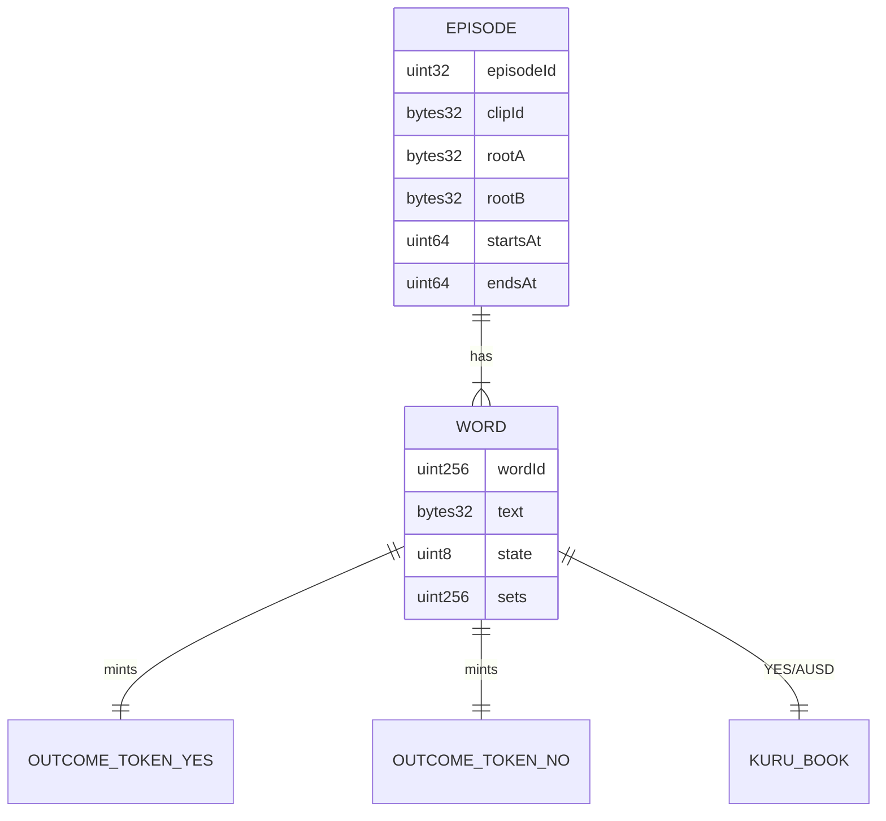
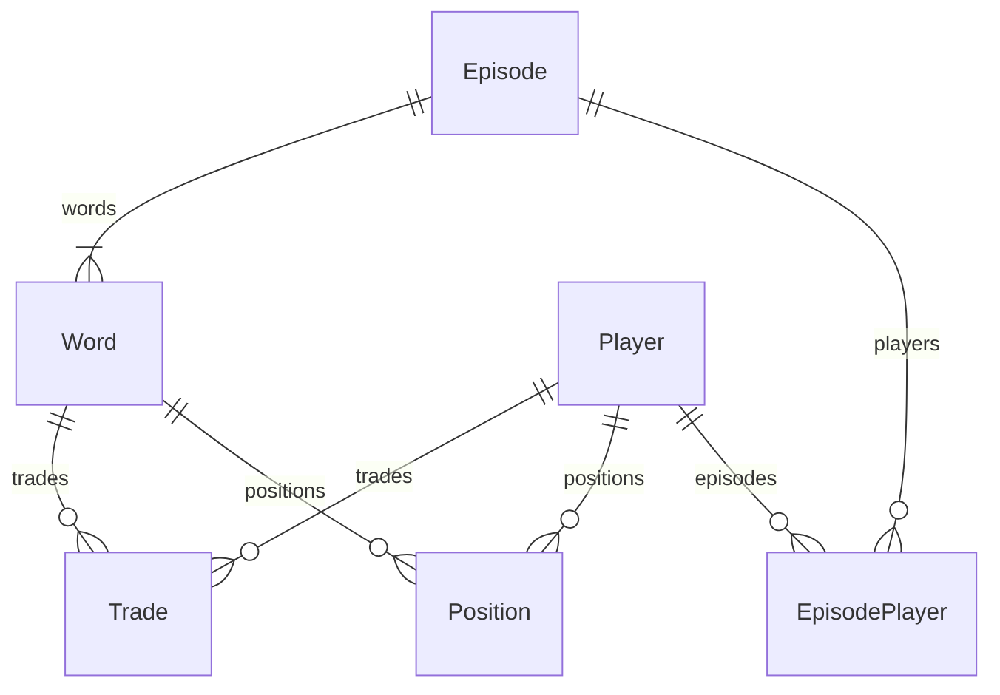

# Data model

Four layers, one truth. The chain owns money and outcomes; Envio and SQLite are read models; transcript files are commitments that become public on schedule.

| Layer | Owner | Holds |
|---|---|---|
| Chain | `SaysoMarkets`, outcome tokens, Kuru books | Episodes, words, collateral, positions, outcomes |
| Envio | `indexer/` | Queryable episodes, trades, positions, profit, leaderboard |
| SQLite | `apps/studio` | Clip library, chunk files, flag plan, scheduled actions, drips, CRE runs |
| Files | `tools/transcribe` output in studio data | Chunk JSON and proofs per engine |

## 1. Chain

Storage structs are defined in `SMART-CONTRACTS.md` section 2. Relationships:



## 2. Envio (GraphQL read model)



| Entity | Fields | Written by |
|---|---|---|
| `Episode` | `id` (episodeId), `clipId`, `rootA`, `rootB`, `startsAt`, `endsAt`, `state`, `wordCount`, `resolvedCount`, `closedAt`, `settledAt` | `EpisodeCreated`, `EpisodeClosed`, `EpisodeSettled`, `WordResolved` |
| `Word` | `id` (wordId), `episode`, `text`, `yes`, `no`, `market`, `state`, `offsetMs`, `flaggedAt`, `outcome`, `evidenceHash`, `resolvedAt`, `resolveTx` | `WordAdded`, `WordListed`, `WordFlagged`, `WordResolved`, `WordVoided` |
| `Trade` | `id` (tx hash + log index), `word`, `player`, `side`, `tokenAmount`, `ausdAmount`, `priceBps`, `timestamp`, `block` | `Traded` |
| `Position` | `id` (player + word), `player`, `word`, `yes`, `no`, `cashIn`, `cashOut`, `redeemed` | `Traded`, `SetMinted`, `SetBurned`, `Redeemed`, outcome-token `Transfer` |
| `Player` | `id` (address), `trades`, `volume`, `cashIn`, `cashOut`, `settledValue`, `profit`, `episodesPlayed`, `firstSeen` | derived from the above |
| `EpisodePlayer` | `id` (episode + player), `profit`, `trades`, `rank` | derived when an episode settles |

Outcome-token clones are registered dynamically from `WordAdded` so their `Transfer` events update positions.

**Profit.** `profit = cashIn − cashOut + settledValue`, where `cashOut` is AUSD spent (buys, `mintSet`), `cashIn` is AUSD received (sells, `burnSet`, redemptions), and `settledValue` is unredeemed winning tokens at 1 AUSD and void tokens at 0.5. Unsettled positions are excluded, so the leaderboard never ranks on a price the player cannot realize. The nickname is derived from the address in `packages/core` and never stored.

Set cash attribution uses the actual economic parties: `SetMinted.payer` gets `cashOut`; its `account` receives both tokens. `SetBurned.recipient` gets `cashIn`; its `account` burns both tokens. Outcome-token `Transfer` alone updates balances. Neither transaction origin nor the event's token holder is substituted for the cash payer/recipient.

## 3. Studio SQLite

```sql
CREATE TABLE clips (
  id            TEXT PRIMARY KEY,          -- manifest id
  clip_id       TEXT NOT NULL UNIQUE,      -- 0x bytes32, keccak256(raw 32-byte sha256(media) || UTF-8 manifest id)
  media_sha256  TEXT NOT NULL,
  duration_ms   INTEGER NOT NULL,
  licence       TEXT NOT NULL,             -- team-recorded | public-domain | CC0
  source_url    TEXT,
  words_json    TEXT NOT NULL,             -- six words, curator order
  root_a        TEXT NOT NULL,
  root_b        TEXT NOT NULL,
  created_at    INTEGER NOT NULL           -- set by the studio at ingest; absent from offline clip.json
);

CREATE TABLE chunks (
  clip_id     TEXT NOT NULL REFERENCES clips(clip_id),
  engine      TEXT NOT NULL CHECK (engine IN ('A','B')),
  idx         INTEGER NOT NULL,
  start_ms    INTEGER NOT NULL,
  end_ms      INTEGER NOT NULL,
  tokens_json TEXT NOT NULL,               -- canonical [["word",start,end],...]
  leaf        TEXT NOT NULL,
  proof_json  TEXT NOT NULL,
  PRIMARY KEY (clip_id, engine, idx)
);

CREATE TABLE flag_plan (                   -- agreed spoken words, computed offline
  clip_id  TEXT NOT NULL REFERENCES clips(clip_id),
  word     TEXT NOT NULL,
  t_ms     INTEGER NOT NULL,
  chunk_a  INTEGER NOT NULL,
  chunk_b  INTEGER NOT NULL,
  PRIMARY KEY (clip_id, word)
);

CREATE TABLE episodes (
  id           INTEGER PRIMARY KEY,        -- onchain episodeId
  clip_id      TEXT NOT NULL REFERENCES clips(clip_id),
  origin       TEXT NOT NULL CHECK (origin IN ('hourly','on_demand')),
  starts_at_ms INTEGER NOT NULL,
  ends_at_ms   INTEGER NOT NULL,
  state        TEXT NOT NULL,              -- Scheduled | Live | Closed | Settled (ARCHITECTURE section 4), mirrored from chain
  create_tx    TEXT, list_tx TEXT, close_tx TEXT
);

CREATE TABLE episode_requests (             -- durable create journal; episodes only hold confirmed chain ids
  id INTEGER PRIMARY KEY,
  origin TEXT NOT NULL CHECK (origin IN ('hourly','on_demand')),
  clip_id TEXT NOT NULL REFERENCES clips(clip_id),
  ip_hash TEXT,
  requested_ms INTEGER NOT NULL,
  starts_at_ms INTEGER NOT NULL,
  ends_at_ms INTEGER NOT NULL,
  create_tx TEXT,
  episode_id INTEGER,
  status TEXT NOT NULL DEFAULT 'creating',
  error TEXT,
  raw_tx TEXT                              -- signed bytes, persisted before broadcast for identical replay
);

CREATE TABLE actions (                     -- every scheduled studio transaction
  id           INTEGER PRIMARY KEY,
  episode_id   INTEGER NOT NULL REFERENCES episodes(id),
  kind         TEXT NOT NULL CHECK (kind IN ('create','list','seed','pull','bid','flag','evidence','close','redeem')),
  word_id      INTEGER,
  scheduled_ms INTEGER NOT NULL,
  sent_ms      INTEGER,
  tx_hash      TEXT,
  block        INTEGER,
  status       TEXT NOT NULL DEFAULT 'pending',
  error        TEXT,
  payload_json TEXT NOT NULL DEFAULT '{}'  -- batch word ids, flag metadata, signed raw transaction
);

CREATE TABLE house_orders (
  market     TEXT NOT NULL,
  order_id   INTEGER NOT NULL,
  episode_id INTEGER NOT NULL,
  side       TEXT NOT NULL CHECK (side IN ('bid','ask')),
  price      INTEGER NOT NULL,
  size       TEXT NOT NULL,
  status     TEXT NOT NULL,
  is_flip    INTEGER NOT NULL DEFAULT 0,
  observed_block INTEGER,
  PRIMARY KEY (market, order_id)
);

CREATE TABLE drips (
  address  TEXT PRIMARY KEY,
  mon_wei  TEXT NOT NULL,
  ausd     TEXT NOT NULL,
  tx_mon   TEXT, tx_ausd TEXT,
  ip_hash  TEXT NOT NULL,
  at       INTEGER NOT NULL,
  status   TEXT NOT NULL DEFAULT 'completed', -- legacy awards remain ineligible
  raw_mon  TEXT, raw_ausd TEXT,               -- signed bytes; never public
  status_mon TEXT NOT NULL DEFAULT 'confirmed',
  status_ausd TEXT NOT NULL DEFAULT 'confirmed',
  block_mon INTEGER, block_ausd INTEGER
);

CREATE TABLE cre_runs (
  id          INTEGER PRIMARY KEY,
  episode_id  INTEGER NOT NULL REFERENCES episodes(id),
  trigger     TEXT NOT NULL CHECK (trigger IN ('evidence','closed')),
  trigger_tx  TEXT NOT NULL,
  mode        TEXT NOT NULL CHECK (mode IN ('simulation','don')),
  status      TEXT NOT NULL,
  report_tx   TEXT,
  started_ms  INTEGER NOT NULL,
  finished_ms INTEGER,
  error       TEXT,
  trigger_log_index INTEGER,                 -- receipt-array position, not block-global logIndex
  trigger_block TEXT,
  word_ids_json TEXT,
  attempts INTEGER NOT NULL DEFAULT 0,
  retry_count INTEGER NOT NULL DEFAULT 0,
  next_attempt_ms INTEGER NOT NULL DEFAULT 0,
  reporter_nonce INTEGER,
  execution_block TEXT
);
CREATE UNIQUE INDEX cre_trigger_log ON cre_runs(trigger_tx, trigger_log_index);
CREATE TABLE cre_runner_state (
  receiver TEXT PRIMARY KEY,
  next_block TEXT NOT NULL
);
```

Clip manifests and transcripts are studio data, not tracked files: a public word list with its transcript would reveal outcomes before trading. The repo tracks one fixture clip under `clips/fixtures/` for tests.

BOT substeps in `actions.payload_json` carry the exact command, signed hash/raw bytes, receipt block and confirmation status. `house_orders` is reconstructed from actual original/replacement Kuru events and live storage, never treated as chain authority.

Drip admission uses lowercase addresses with case-insensitive legacy lookup, a deployment-stable private HMAC salt over canonical direct-peer IPs, and an atomic SQLite reservation. Both transfer legs must confirm before `completed`; partial awards resume only the missing leg. Public responses omit signed bytes and IP hashes. Legacy rows and their transaction evidence are preserved unchanged.

CRE trigger identity is `(trigger_tx, trigger_log_index)`; the durable cursor advances only after every discovered trigger is enqueued. Statuses: `pending`, `running`, `observing` (DON), `ambiguous`, `success`, `reconciled`, `superseded`, `no-report`, `failed`. Only corroborated onchain receiver/forwarder receipts populate `report_tx`; attempted simulation reports must match the recorded REPORTER nonce. `no-report` proves no submission was entered, not successful settlement. CLI write ambiguity gates REPORTER until receipt reconciliation; neither a timeout nor a void authorizes replacement signing.

## 4. Files and payloads

**Chunk payload** (reveal API and CRE input):

```json
{
  "clipId": "0x…",
  "engine": "A",
  "index": 7,
  "startMs": 70000,
  "endMs": 80000,
  "tokens": [["monad", 71240, 71690], ["is", 71690, 71800]],
  "leaf": "0x…",
  "proof": ["0x…", "0x…"]
}
```

**Offline transcription output** (`tools/transcribe`, written outside the repo; an existing clip directory is refused):

- Input manifest: `{id, licence, sourceUrl?, words}`; `id` is a lowercase ASCII slug, `words` six distinct valid targets in curator order, `licence` one of `team-recorded | public-domain | CC0`.
- `<out>/<id>/clip.json`: the `clips` row fields above except `created_at`, so two runs on the same media are byte-identical.
- `<out>/<id>/flag-plan.json`: each word → its agreed first-said time or `null`.
- `<out>/<id>/chunks/{A,B}/<index>.json`: the chunk payload above. The final chunk ends at the next 10 s boundary.

**CRE report:** `abi.encode(uint32 episodeId, uint256[] wordIds, uint8[] outcomes, bytes32 evidenceHash)`; outcome `2` = Yes, `3` = No (matching `WordState`); `evidenceHash = keccak256` of the concatenated leaves the workflow verified.
